# Software Maintenance — Examination Report

## Maintaining the Copy/Paste Functionality (Basic Editing) in JHotDraw

**Full Name:** [Your Full Name]
**Student Exam Number:** [Exam Number]
**Student Email:** claudiuispas563@gmail.com
**Course:** Software Maintenance (SB-MAI), 5 ECTS
**Lecturer:** Jan Corfixen Sørensen — [lecturer email]
**Date:** 11 June 2026
**Number of pages:** [fill in after PDF export — target 19–20]

*Inspected repository: github.com/JakubPotocky/JHotDraw — branch `copy-paste-basic-editing-labs` — head commit `b4eea564` ("Copy/paste labs with tests and docs"), forked from wumpz/jhotdraw.*

---

## Abstract

This report is a part of the 5 ECTS Software Maintenance course, which has the objective of analysing, refactoring, and verifying an existing codebase in order to remove bad code smells and to ensure a clean and maintainable code architecture. The report documents a complete pass through the phased model of software change — initiation, concept location, impact analysis, prefactoring, actualization, postfactoring, and verification — applied to the Copy/Paste functionality of the basic editing feature in the JHotDraw drawing framework. All technical claims are supported by file paths, line numbers, code snippets, or commit references from the inspected repository: the team fork JakubPotocky/JHotDraw, branch `copy-paste-basic-editing-labs`, head commit `b4eea564`. On this branch, a duplication-removing Extract Method refactoring of the paste path was performed and committed, a dead method was deleted, and documentation smells were fixed — together with a JUnit characterisation test suite and BDD-style scenario tests for Copy/Paste. The full suite of 13 tests was executed and passed: `Tests run: 13, Failures: 0, Errors: 0, Skipped: 0`.

---

## 1. Introduction

The objective of this project is to practise software maintenance on a real, existing system rather than to develop new software from scratch. Software maintenance is dominated by incremental change: a change request is received, the relevant concepts are located in the code, the impact of the change is estimated, the code is prepared through refactoring, the change is actualized, and the result is verified and integrated. This report enacts that process on a selected feature of JHotDraw and documents each phase together with the supporting evidence.

### 1.1 The case system: JHotDraw

JHotDraw is a two-dimensional drawing framework for Java, originally developed as a design exercise by Erich Gamma and Thomas Eggenschwiler and later reimplemented as JHotDraw 7 by Werner Randelshofer. It is widely used in teaching because its design is deliberately built around well-known design patterns such as Framework, Model–View–Controller, Command, Prototype, Strategy, Composite, and Observer. The version used in this course is the Maven-based modularisation of JHotDraw 7 originally hosted on GitHub as wumpz/jhotdraw; the inspected repository is the team fork JakubPotocky/JHotDraw. The codebase is split into the modules `jhotdraw-core`, `jhotdraw-actions`, `jhotdraw-datatransfer`, `jhotdraw-api`, `jhotdraw-app`, `jhotdraw-gui`, `jhotdraw-utils`, `jhotdraw-xml`, and `jhotdraw-samples`. The application is built with Maven (`mvn clean install -DskipTests`) and the sample applications are started from the `jhotdraw-samples-misc` module, as described in the Introduction Lab.

### 1.2 Selected feature work area: Copy/Paste from basic editing

The feature work area selected for this report is the Copy/Paste functionality of the basic editing feature (backlog feature Basic editing #12, with sub-features Copy #13 and Paste #14). This feature was selected as the scope of work for three reasons. First, it is a core, user-visible feature: every user of a drawing editor expects to be able to copy a selected figure and paste it back into the drawing — a graphic designer building a diagram out of repeated shapes is the typical stakeholder. Second, it cuts across several architectural layers — actions, the clipboard abstraction, the drawing view, and the input/output format machinery — which makes it an instructive case for concept location and impact analysis. Third, the implementation contained identifiable code smells (a very long import method with triplicated logic, a dead method, weak error handling, and documentation typos), which made it a realistic target for prefactoring and refactoring. The refactoring and the accompanying tests have been carried out and committed on the branch `copy-paste-basic-editing-labs` (commit `b4eea564`) and are documented with diff- and line-level evidence in this report.

---

## 2. Initiation

### 2.1 The software change process model

The course follows the phased model of software change as presented in the lectures and in Rajlich's *Software Engineering: The Current Practice*. A software change starts with **initiation**, where a change request enters the backlog. The request is then traced into the source code during **concept location**, which produces the initial impacted set of classes. **Impact analysis** extends this set by following dependencies, producing the estimated impacted set. **Prefactoring** prepares the code for the change, **actualization** implements the change and propagates it, **postfactoring** cleans up the resulting structure, and **verification** confirms the behaviour through testing. The change is concluded by integrating it into a baseline through the team's continuous integration pipeline.

### 2.2 The change request and user stories

Software changes are started by creating a change request, which can be a new feature, a bug fix, or an improvement (ChangeReqLab). Since this is a maintenance project and not an "implement a new feature" project, the change request concerns the existing Copy/Paste capability. JHotDraw's original user stories are not available, so the stories are reconstructed for this case study, as instructed in the Change Request Lab:

> **Copy:** "As a graphic designer user, I want to copy a selected figure to the clipboard, so that I can quickly duplicate existing work without recreating it manually."

> **Paste:** "As a graphic designer user, I want to paste a copied figure back into my drawing, so that I can quickly place a duplicate on the canvas and reuse elements of my drawings."

The feature already works; the requested change is therefore a *maintenance* change: during analysis the central paste implementation turned out to contain heavily duplicated code, and the change request became **removing that duplication while preserving the exact user-visible behaviour**.

### 2.3 Expected behaviour at task level — acceptance criteria

At task level, the expected behaviour is described without prescribing the implementation. The acceptance criteria below were elaborated in the Change Request Lab and are recorded in the committed lab artefact `BobsWork/02_ChangeReqLab_Copy_Paste.md` (summarised in `BobsWork/Portfolio_Copy_Paste.md`):

| User story | Acceptance criteria |
| --- | --- |
| Copy | 1. The user can select one or more figures on the canvas. 2. The user can trigger Copy through menu, shortcut, or toolbar/popup action. 3. The selected figures are exported to the clipboard. 4. The original figures remain unchanged in the drawing. 5. The copied data can later be pasted into a compatible drawing view. |
| Paste | 1. The user can trigger Paste through menu, shortcut, or toolbar/popup action. 2. The command reads the clipboard. 3. If the clipboard contains a supported format, figures are imported into the active drawing. 4. Imported figures become selected. 5. Paste creates an undoable edit. 6. Unsupported clipboard content does not corrupt the drawing. |

*Table 0: Acceptance criteria for the Copy and Paste user stories (from the committed change-request artefact).*

In addition: Cut places the selection on the clipboard and removes the selected figures undoably, and Copy/Cut on an empty selection must not corrupt the clipboard or the drawing.

### 2.4 Why this feature belongs to basic editing

Copy, Cut, Paste, Duplicate, Delete, and Select All are the canonical operations of an Edit menu, and JHotDraw treats them as a single family. The repository confirms this grouping in two places. First, the actions are implemented together in the package `org.jhotdraw.action.edit` (module `jhotdraw-actions`), all derived from the shared base class `AbstractSelectionAction`. Second, the default menu builder installs them together as the clipboard group of the Edit menu (`DefaultMenuBuilder.addClipboardItems(...)`, line 272 of `jhotdraw-app/src/main/java/org/jhotdraw/app/DefaultMenuBuilder.java`):

```java
if (null != (a = am.get(CutAction.ID)))       { add(m, a); }
if (null != (a = am.get(CopyAction.ID)))      { add(m, a); }
if (null != (a = am.get(PasteAction.ID)))     { add(m, a); }   // line 281
if (null != (a = am.get(DuplicateAction.ID))) { add(m, a); }
```

*Snippet 1: The clipboard items of the Edit menu are built as one group, confirming that Copy/Paste belongs to basic editing.*

### 2.5 Team pipeline

Following the Introduction Lab and the Continuous Integration Lab, the team works on a GitHub fork of the shared JHotDraw repository using the GitHub flow: the shared baseline lives on `develop`, each member works on a feature branch, and changes are merged through pull requests that trigger an automated Maven build. The inspected repository evidences this in practice: alongside `develop` there are the member feature branches `AlansBranch`, `feature/Image-Tool`, `feature/lab1`, `undo/redo`, and the branch of this report, `copy-paste-basic-editing-labs`. The develop history additionally shows team integration work (merge commit `ba1a91b0`) and the continuous-integration setup series starting at commit `c84f39ca` ("set up CI", Section 9). All work for this change request was committed to the dedicated feature branch in commit `b4eea564`; the branch is integrated back through a pull request, which gives a natural code-review point and shows the CI status before merging — the baseline only ever receives changes that build green.

---

## 3. Concept Location

The objective of concept location is to find the work area: to map the domain concepts named in the user stories (copy, paste, edit, selection, clipboard, drawing, figure, command/action) onto concrete classes in the codebase.

### 3.1 Methodology: grep search, dependency search, dynamic confirmation

The basic steps of the search are: formulate a search query from the change request, find a starting set of modules (typically with grep), select one candidate and inspect it, decide whether the concept is implemented there, and if not, either follow dependencies to supplier modules or backtrack and try another candidate, repeating until the concept is located.

**Grep vs. dependency search** is essentially unstructured versus structured search. Grep is a plain text match over the codebase: fast, needs no starting point — searching for "copy", "paste", "Transferable" and "clipboard" landed on `CopyAction` and `PasteAction` within seconds. Its disadvantage is that it ignores program structure: it returns false positives (any comment containing "copy") and misses concepts implemented under different vocabulary (the paste logic itself never contains the word "paste" in the handler's import loop). Dependency search moves along the real structure of the program — from a class to its suppliers and clients via "go to definition" and "find usages" — so every step is meaningful, but it requires a starting point. In practice they complement each other: grep to get in, dependency search to close in.

**Static vs. dynamic analysis** differ in whether the program runs. Static analysis (grep, dependency search, code reading) covers all code paths but can mislead about what actually executes — the handler has Mac and non-Mac branches, and statically one cannot tell which one runs. Dynamic analysis (debugger breakpoints in `CopyAction.actionPerformed`, `PasteAction.actionPerformed`, `DefaultDrawingViewTransferHandler.importData` and `DOMStorableInputOutputFormat.read`, then performing a real copy/paste in the running Draw sample) tells exactly what really runs — every breakpoint was hit in the expected order — but only for the scenario exercised.

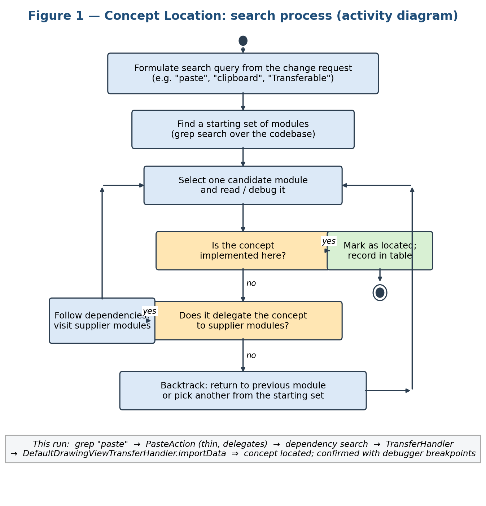

*Figure 1: Activity diagram of the concept location search process, annotated with the concrete run: grep "paste" → PasteAction (delegates) → dependency search → TransferHandler → DefaultDrawingViewTransferHandler.importData ⇒ concept located; confirmed with debugger breakpoints.*

### 3.2 Domain classes and responsibilities

Table 1 is the template-mandated two-column table of domain classes and responsibilities, listed in the order they were visited (tools used: grep for rows 1–2 and 14, dependency search for rows 3–9 and 13, IDE debugger for rows 5–6, 10 and 12, code reading for the rest).

| Domain Class | Responsibility |
| --- | --- |
| `CopyAction` (jhotdraw-actions, `ID = "edit.copy"`) | Controller entry point for copy; resolves the focused component and delegates to `TransferHandler.exportToClipboard(..., COPY)`. Thin Command-pattern class — the feature logic is not here. |
| `PasteAction` (`ID = "edit.paste"`) | Controller entry point for paste; reads the clipboard via `ClipboardUtil` and delegates to `TransferHandler.importData(...)`. A null clipboard content is already a safe no-operation. |
| `CutAction` (`ID = "edit.cut"`) | Sibling clipboard action; exports with the MOVE action so source figures are removed. Shares the focused-component lookup with copy/paste — duplication noted for later. |
| `AbstractSelectionAction` | Shared base class for the selection edit actions; listens to `SELECTION_EMPTY_PROPERTY` to enable/disable the actions. |
| `DefaultDrawingView` (jhotdraw-core) | The drawing canvas; installs `DefaultDrawingViewTransferHandler` on itself (line 305) and owns the selection that copy exports; implements `EditableComponent`. |
| `DefaultDrawingViewTransferHandler` | **The core class of the concept:** exports selected figures on copy (`createTransferable`) and imports figures on paste (`importData`). This is where the duplication was found. |
| `Drawing` / `AbstractDrawing` / `DefaultDrawing` | The drawing model; contains figures and the registered input/output formats the handler iterates over; fires undoable edits. |
| `Figure` and implementations | The domain objects being copied, pasted and selected; cloned via `f.clone()` (Prototype pattern). |
| `InputFormat` / `OutputFormat` (org.jhotdraw.draw.io) | Strategy-style interfaces: writing selected figures to a transferable (copy) and reading a transferable into figures (paste). |
| `DOMStorableInputOutputFormat` | The Draw sample's main format for native drawing clips; the breakpoint in `read(...)` was hit during paste. |
| `SerializationInputOutputFormat`, `ImageInputFormat`, `ImageOutputFormat`, `TextInputFormat` | Alternative formats: serialized drawings, images and plain text can also be pasted. |
| `CompositeTransferable` (jhotdraw-datatransfer) | Combines several transfer formats into one clipboard content during copy (Composite pattern). JavaDoc contained typos. |
| `ClipboardUtil`, `AWTClipboard`, `OSXClipboard`, `JNLPClipboard` | Singleton access to the system clipboard with platform-specific proxies and a JVM-local fallback; `setClipboard(...)` (line 62) is an injection seam for tests. |
| `DefaultApplicationModel`, `DefaultMenuBuilder` (jhotdraw-app) | Register the copy/paste actions in the ActionMap and place them in the Edit menu. |
| `DefaultDrawingEditor` | Maps the keyboard shortcuts to the copy/paste action IDs. |
| `ButtonFactory`, `DrawingPanel`, `DrawView` | Expose the actions in toolbars/popup and register the input/output formats in the Draw sample. |

*Table 1: Concept location — domain classes mapped to responsibilities (template two-column form).*

### 3.3 Conclusion of concept location

Copy/Paste in JHotDraw is a composite concept spread over the action layer, the Swing transfer infrastructure, the drawing model, clipboard utilities, and IO formats — it is not implemented in a single class. The Edit-menu actions are thin Command-pattern objects that delegate to the standard Swing data-transfer mechanism; the actual feature logic lives in `DefaultDrawingViewTransferHandler`, which bridges between the Swing clipboard API and JHotDraw's Drawing/Figure model through the InputFormat/OutputFormat strategies. The **initial impacted set** produced by this phase is: `CopyAction`, `PasteAction`, `DefaultDrawingViewTransferHandler`, `DefaultDrawingView`, `Drawing`, `DOMStorableInputOutputFormat`, and `ClipboardUtil` (seven classes).

```java
// jhotdraw-actions/.../action/edit/CopyAction.java — actionPerformed(...)
public class CopyAction extends AbstractSelectionAction {
    public static final String ID = "edit.copy";
    @Override
    public void actionPerformed(ActionEvent evt) {
        JComponent c = target;
        if (c == null && (KeyboardFocusManager.getCurrentKeyboardFocusManager()
                .getPermanentFocusOwner() instanceof JComponent)) {
            c = (JComponent) KeyboardFocusManager.getCurrentKeyboardFocusManager()
                    .getPermanentFocusOwner();
        }
        if (c != null) {
            c.getTransferHandler()
                .exportToClipboard(c, ClipboardUtil.getClipboard(), TransferHandler.COPY);
        }
    }
}
```

*Snippet 2: CopyAction is a thin command that resolves the focused component and delegates the export to its TransferHandler — evidence that the feature logic is not in the action itself. The same focused-component lookup recurs in `CutAction` (lines 60–62) and `PasteAction` (lines 61–63).*

---

## 4. Impact Analysis

Change impact analysis means identifying the potential consequences of a change, or estimating what needs to be modified to accomplish it. Its purpose, in practical terms, is to reduce the "fumbling in the dark" before changing a codebase you do not fully know: in a framework like JHotDraw, where everything is wired through abstractions and extension points, the ripple of a change is not visible from the file being edited. The analysis gives a defensible prediction of what will be touched and what must be re-verified — and it dictates scope: it is the moment to decide what will *not* change.

The **initial impacted set** is the set of classes directly identified during concept location — the obvious suspects. The **estimated impacted set** is the output of impact analysis: the initial set extended with everything that change propagation could plausibly reach, refined by marking what will actually change. The estimate can both over- and under-approximate; Section 6 compares it against the classes actually touched by commit `b4eea564`.

### 4.1 Static impact analysis

Static analysis was performed without executing the program, by following imports and call sites outward from the initial impacted set. Three dependency chains dominate the work area:

1. **The action chain:** `CopyAction`, `CutAction`, and `PasteAction` extend `AbstractSelectionAction`, which depends on the `EditableComponent` contract in `jhotdraw-api`; the actions are instantiated in `DefaultApplicationModel.createActionMap(...)` and placed into the Edit menu by `DefaultMenuBuilder.addClipboardItems(...)` (line 272).
2. **The transfer chain:** the actions call into the `TransferHandler` of the focused component; for a drawing view this is `DefaultDrawingViewTransferHandler`, installed in the `DefaultDrawingView` constructor (line 305). The handler serialises figures through the `OutputFormat` strategies into a `CompositeTransferable` and deserialises them through the `InputFormat` strategies (`org.jhotdraw.draw.io`).
3. **The model chain:** import and export manipulate `Drawing` and `Figure` objects and register undoable edits on the drawing, which couples the feature to the undo/redo mechanism.

Two analysis concepts are worth distinguishing here. A **dependency** is structural — class A declares a field, parameter or supertype of type B, visible in the source: `importTransferData(...)` declares parameters of type `DrawingView` and `Drawing`. A **coordination** is data flow between two classes by proxy of a third: the line `view.addToSelection(importedFigures)` coordinates the `Drawing` and the `DrawingView` through the handler — the figures come out of the drawing's children and flow into the view's selection, yet the two classes never talk to each other directly. Coordinations matter because they do not show up as a direct dependency, yet a change in one class can still break the other. A **propagating class** is one that is visited and read because it carries the search and the runtime behaviour toward the concept, but is not changed — `PasteAction` is the textbook example: every paste flows through it, but the change leaves it untouched.

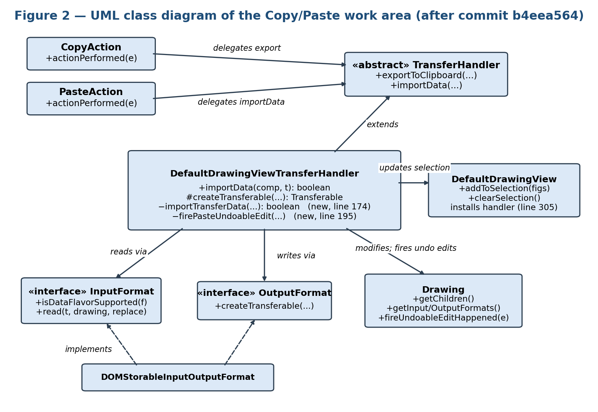

*Figure 2: UML class diagram of the Copy/Paste work area, created during impact analysis (state after commit b4eea564; the mermaid source below is the editable form of the same diagram).*

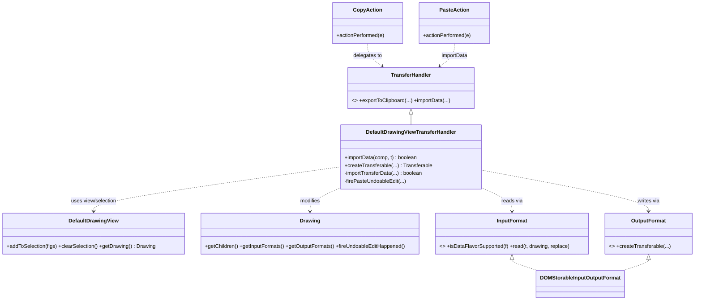

*Figure 2 (renderable form): UML class diagram of the work area after the change.*

On diagrams in impact analysis: the class diagram shows precise structure — fields, methods, interface implementations — good for reasoning about whether a signature change breaks a client, but it scales badly and shows nothing about runtime behaviour. A package-level dependency view gives the whole-system view and exposes clusters (JHotDraw's `draw`, `io` and `action` packages are heavily interconnected) but obscures *where* and *why* two packages depend on each other. Both were used: the class diagram for the core, the package table below for the summary.

### 4.2 Dynamic impact analysis

Dynamic analysis confirms statically identified dependencies by executing the program. The Draw/SVG sample application is started from the `jhotdraw-samples-misc` module, and the runtime path is confirmed with the breakpoint set documented in the committed concept-location artefact (`BobsWork/03_CLLab_Concept_Location_Copy_Paste.md`):

- `CopyAction.actionPerformed` and `PasteAction.actionPerformed` (command entry),
- `DefaultDrawingViewTransferHandler.createTransferable` (hit on Edit → Copy),
- `DefaultDrawingViewTransferHandler.importData` (hit on Edit → Paste),
- `DOMStorableInputOutputFormat.createTransferable` / `read` (format negotiation),
- `DefaultDrawingView.addToSelection` (selection of the pasted figures).

Every breakpoint was hit in the expected order, confirming at runtime that the menu actions reach the transfer handler through the Swing focus and data-transfer machinery. To confirm that a modification is actually applied at runtime, a small visible change (for example changing the duplicate offset `tx.translate(5, 5)` in `DefaultDrawingView.duplicate()`) is made, the project recompiled, and the visibly different offset observed after pasting.

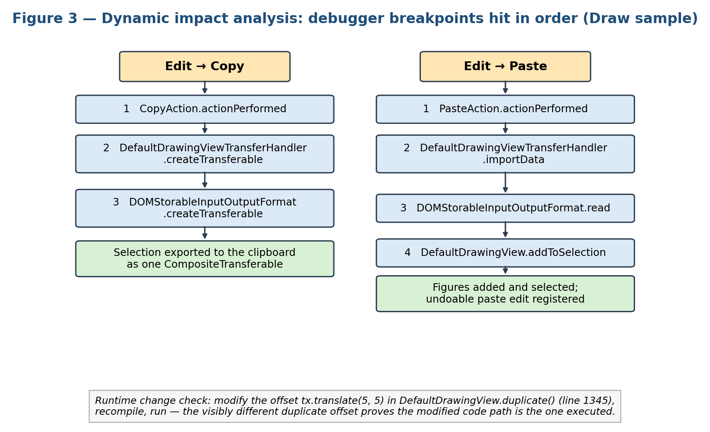

*Figure 3: Dynamic confirmation — the debugger breakpoints hit in order during a live Copy and a live Paste in the Draw sample, with the runtime change check (tx.translate(5, 5), DefaultDrawingView.java line 1345). An IDE debugger screenshot can be substituted here at the exam.*

In addition, the test suite committed in `b4eea564` (Section 8) provides an automated, repeatable form of dynamic confirmation, since the tests execute the import/export paths against a live `DefaultDrawingView` and assert on the resulting model state.

### 4.3 Package list and estimated impacted set

Table 2 is the template-mandated three-column package list (9 packages, 35 classes visited in total; classification Changed / Propagating / Unchanged in the comments).

| Package name | # of classes | Comments |
| --- | ---: | --- |
| `org.jhotdraw.draw` (jhotdraw-core) | 6 | The most important package: drawing view, drawing abstraction, editor shortcut map, and the transfer handler. **Changed** — `DefaultDrawingViewTransferHandler` is the refactoring target (debugger + dependency search). |
| `org.jhotdraw.datatransfer` (jhotdraw-datatransfer) | 7 | Clipboard proxies and transferable wrappers. **Changed (documentation only)** — `CompositeTransferable` JavaDoc typos and non-final fields (debugger + reading code). |
| `org.jhotdraw.action.edit` (jhotdraw-actions) | 5 | Copy, paste, cut, duplicate and their shared base. **Propagating** — they route every copy/paste into the handler and guided the search, but stay untouched (grep + dependency search). |
| `org.jhotdraw.draw.io` (jhotdraw-core) | 7 | `InputFormat`/`OutputFormat` implementations. **Propagating** — paste flows through them; the existing extension point already does its job (debugger + reading code). |
| `org.jhotdraw.api.gui` (jhotdraw-api) | 1 | `EditableComponent` contract used by the basic editing actions; carries a documented FIXME (line 16). **Unchanged** (dependency search). |
| `org.jhotdraw.draw.figure` (jhotdraw-core) | 3 | Figure abstractions created by the paste formats. **Unchanged** (reading code). |
| `org.jhotdraw.app` (jhotdraw-app) | 2 | `DefaultApplicationModel`, `DefaultMenuBuilder` — register copy/paste in application menus. **Unchanged** (grep). |
| `org.jhotdraw.gui.action` (jhotdraw-gui) | 1 | Adds the actions to toolbar/popup collections. **Unchanged** (grep). |
| `org.jhotdraw.samples.draw` (jhotdraw-samples-misc) | 3 | Registers the IO formats and exposes the actions in the Draw sample UI. **Unchanged** in production code; this is where the tests were later placed (reading code). |

*Table 2: Package list with the estimated impacted set for the Copy/Paste change task (template three-column form).*

The initial impacted set contained 7 classes. Dependency inspection extended this to an estimated impacted set across 9 packages / 35 classes, of which the estimated *changed* set was: `DefaultDrawingViewTransferHandler` (certain), `CompositeTransferable` (documentation), and possibly the three action classes (shared focused-component lookup). Comparing the estimate against the actual change in commit `b4eea564` confirms it was a safe over-approximation: only `DefaultDrawingViewTransferHandler` and `CompositeTransferable` were modified in production code, while three test classes were added. The action-class duplication was deliberately *not* propagated into (Section 6.2) — the actual change set is a strict subset of the estimated set, with zero surprises outside it.

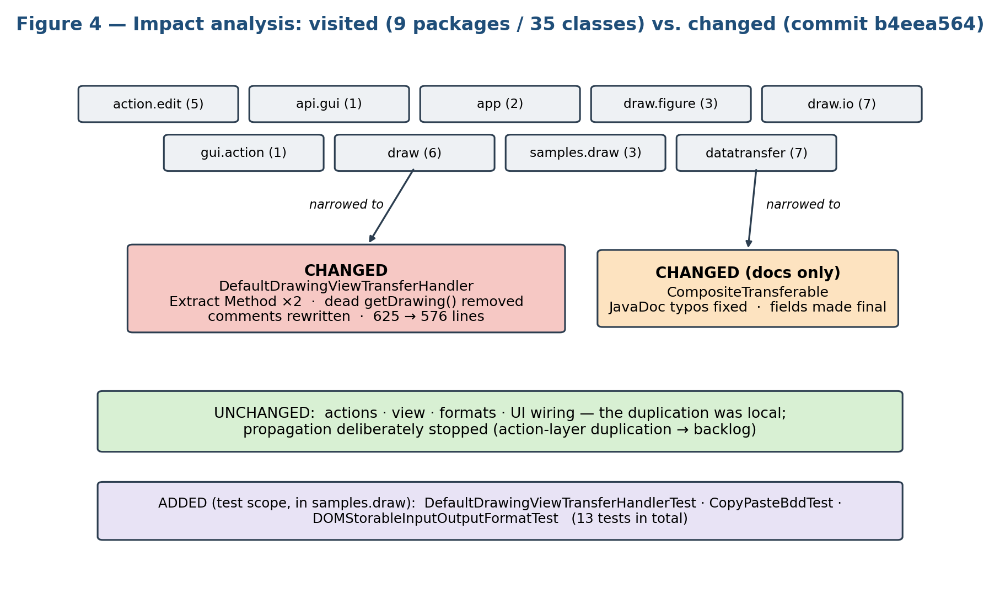

*Figure 4: Summary of impact analysis — 9 visited packages / 35 classes narrowing to one changed class plus one docs-only change, with the added test package.*

---

## 5. Prefactoring

Prefactoring prepares the code base for the change before new functionality is touched. Refactoring is "a disciplined technique for restructuring an existing body of code, altering its internal structure without changing its external behavior" (Refactoring Lab; [Fow18]). In this section the methodologies of *Clean Code* (Robert C. Martin) are applied to the Copy/Paste work area. Only smells supported by direct code inspection of the repository are reported. Smells are described against the pre-change state (the parent of `b4eea564`); the table in Section 5.4 records for each smell whether the refactoring was performed in `b4eea564` or remains planned.

### 5.1 Identified code smells

**5.1.1 Long Method with triplicated logic (Duplicated Code).** Before the change, `DefaultDrawingViewTransferHandler` was 625 lines long, and its main `importData(JComponent, Transferable, HashSet<Figure>, Point)` method spanned roughly 185 lines. The same ~35-line sequence — snapshot the existing figures, read the transferable into the drawing, compute which figures are new, select them, move them to the drop point, and register an anonymous `AbstractUndoableEdit` — existed **three times**: once in the branch guarded by `System.getProperty("os.name").toLowerCase().startsWith("mac")` (a documented "Workaround for Mac OS X"), once in the default flavor-ordering path, and the undo-edit construction a third time in the `FileFormatLoop` that handles dropped files. This violates the Clean Code guidance on functions (small, do one thing, the Stepdown Rule) and is Duplicated Code in Fowler's sense: any fix to the import semantics had to be applied two or three times — and it is only a matter of time before someone updates one copy and forgets the others, producing inconsistent behaviour between platforms (precisely the kind of bug that is miserable to reproduce, since it only appears on a Mac).

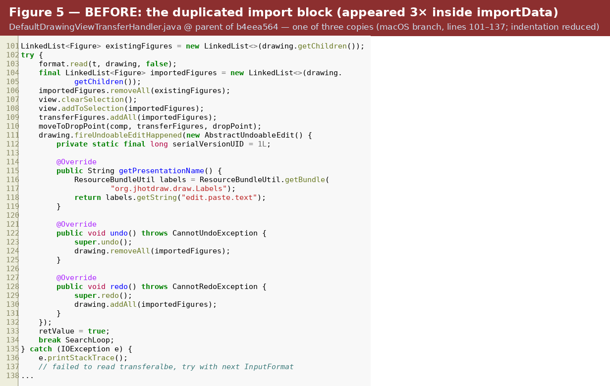

*Figure 5: The duplicated import block exactly as it appeared in the pre-change file (macOS copy, original lines 101–137; the same sequence recurred in the default branch and the undo construction a third time in the file-drop path).*

**5.1.2 Dead Code.** An unused private method `getDrawing()` whose entire body was `throw new UnsupportedOperationException("Not yet implemented")` — confirmed unused via find-usages.

**5.1.3 Duplicated focus-owner resolution across the actions.** `CopyAction`, `CutAction`, and `PasteAction` each repeat the same block in `actionPerformed(...)` that resolves the target component from the `KeyboardFocusManager` when `target` is null (compare Snippet 2 with `CutAction.java` lines 60–62 and `PasteAction.java` lines 61–63). This is duplication across sibling classes sharing the common parent `AbstractSelectionAction`.

**5.1.4 Redundant statement in `exportDone(...)`.** The statement `drawing.removeAll(selectedFigures);` occurs twice in immediate succession (lines 344 and 346 of the current file), separated only by the removal of the temporary `CompositeFigureListener`. The second call is redundant for the normal cut flow; it silently double-fires removal logic, which complicates reasoning about cut/undo behaviour.

**5.1.5 Inadequate error handling.** The handler swallows `IOException` with `e.printStackTrace()` in several places (current lines 165, 189, 304, and 422), including `createTransferable(...)`, where the caller cannot distinguish "nothing selected" from "serialisation failed". Clean Code's chapter on error handling discourages reporting failures to the console only.

**5.1.6 Comment smells and misleading names.** `CompositeTransferable` had the misspelled JavaDoc title "ComoositeTransferable" and "wjether" for "whether", plus two mutable collection fields never reassigned; the handler contained the misspelled comment `// failed to read transferalbe` and an apologising "This ugly code sequence is needed..." comment; `exportDone(...)` contains dead code by comment (`// view.clearSelection();`, line 332).

**5.1.7 Documented design debt (FIXME) and global state.** `EditableComponent` (jhotdraw-api) carries a FIXME at line 16: "Investigate if we can replace this interface by querying the TransferHandler of a component and retrieve its cut/copy/paste actions." Related: `ClipboardUtil` exposes the clipboard as mutable static state (Singleton), mitigated by the `setClipboard(...)` injection seam (line 62).

How smells are identified: by reading code with the smell catalogs in mind ([Fow18], [Ker05] ch. 4) and by letting tools help — the IDE's duplicate detection highlights the triplicated block instantly, and static analysis tools such as SonarQube catch a subset automatically. But a smell is only "a surface indication that usually corresponds to a deeper problem", not a verdict: each finding was investigated before refactoring.

### 5.2 Template dimensions: names, functions, comments, formatting

- **Meaningful Names** (Clean Code ch. 2, p. 19): the work area is largely sound — `createTransferable`, `importData`, `exportedFigures` reveal intent. The change improves this dimension: the extracted methods are named for what they do — `importTransferData(...)` and `firePasteUndoableEdit(...)` — and the misleading "ComoositeTransferable" JavaDoc was corrected. *(Image example: Figure 6/7 below.)*
- **Functions — the Stepdown Rule, removing redundancy and unused methods:** after extraction, `importData` reads as the high-level search story, `importTransferData` as the import mechanics, and `firePasteUndoableEdit` as the undo detail — the code reads top-down. The unused `getDrawing()` was deleted. *(Image example: Figure 6.)*
- **Comments:** the JavaDoc of `CompositeTransferable` was fixed ("wjether" → "whether"); the comment `// failed to read transferalbe` was rewritten as a proper sentence ("// Failed to read transferable; try with the next InputFormat.") inside the extracted method. Remaining issue recorded honestly: the commented-out `// view.clearSelection();` (line 332) is still present.
- **Formatting — vertical openness and vertical closeness:** extraction improves vertical formatting as a by-product: each concept now sits in its own short, vertically dense method (closeness) separated by blank lines from the next concept (openness), instead of one 185-line block.

### 5.3 Choice of refactoring strategy

There is not one way to remove this duplication, and the choice was explicit. From [Ker05], the duplication-related patterns considered were **Form Template Method** and **Extract Composite**; both target duplication *across sibling subclasses*, where variant steps differ and a skeleton can be pulled into a superclass. The duplication here, however, was entirely *within one class*, and the three copies were identical, not variants. The appropriate move was therefore the more fundamental **Extract Method** refactoring ([Fow18]), applied deliberately **twice** rather than once: `importTransferData(...)` for the import sequence and `firePasteUndoableEdit(...)` for the undo registration. Keeping them separate respects the Stepdown Rule and means a future change to undo behaviour does not touch import mechanics at all; a single-method extraction would have recreated a smaller "does two things" function. Additionally, **Remove Dead Code** was applied to `getDrawing()`, and comment/documentation cleanup to both classes.

### 5.4 Refactoring: performed and planned

| Code smell | Location | Refactoring strategy and status |
| --- | --- | --- |
| Long Method with triplicated import logic | `importData(...)` in `DefaultDrawingViewTransferHandler` | Extract Method ×2: `importTransferData(...)` + `firePasteUndoableEdit(...)`. **PERFORMED** in `b4eea564` (147 lines changed, file 625 → 576). |
| Dead Code | private `getDrawing()` in the handler | Remove Dead Code. **PERFORMED** in `b4eea564` (verified in the diff). |
| Misspelled JavaDoc, non-final fields | `CompositeTransferable` | Fix documentation; make fields `final`. **PERFORMED** in `b4eea564`. |
| Comment smells | `// failed to read transferalbe` | Rewritten as a proper sentence inside the extracted method. **PERFORMED**. |
| Duplicated focus-owner resolution | `actionPerformed(...)` in Copy/Cut/PasteAction | Pull Up Method: protected `resolveTarget()` in `AbstractSelectionAction`. **PLANNED** (backlog — see Section 6.2 for the scope decision). |
| Redundant statement | doubled `drawing.removeAll(selectedFigures)` at lines 344/346 | Remove redundancy, guarded by a cut+undo characterisation test. **PLANNED**. |
| Exceptions swallowed to console | `printStackTrace()` at lines 165, 189, 304, 422 | Introduce `java.util.logging` and a documented null/false contract. **PLANNED**. |
| Dead code by comment | `// view.clearSelection();` line 332 | Delete the line (version control preserves history). **PLANNED**. |
| Long parameter list (introduced by extraction) | `importTransferData(...)` — seven parameters (line 174) | Introduce Parameter Object (an ImportContext). **PLANNED** as postfactoring. |
| Global mutable state (Singleton) | `ClipboardUtil.instance` | Keep; document `setClipboard(...)` (line 62) as the official test seam; longer term inject the Clipboard. **PLANNED**. |

*Table 3: Code smells with refactoring strategy and status.*

### 5.5 Summary of the prefactoring section

Code inspection identified one long method with triplicated import logic, a dead method, duplication across the sibling actions, a doubled statement in the cut path, weak error handling, comment smells, and one documented design-debt item. The highest-value transformations — Extract Method ×2 on the import path, Remove Dead Code, and the naming/immutability fixes — were performed and committed in `b4eea564`, protected by the characterisation tests committed in the same change (Section 8). The remaining items are recorded honestly as planned, including one residual smell (the seven-parameter helper) that the performed extraction itself introduced.

---

## 6. Actualization

The actualization phase consists of the implementation of the change, its incorporation into the old code, and change propagation that seeks out and updates all places requiring secondary modification (Actualization Lab). For this change request, actualization is the performed maintenance change of commit `b4eea564`: the consolidation of the paste path inside the existing architecture, its secondary modifications, and the test harness that pins the behaviour.

### 6.1 How Copy/Paste fits the existing architecture

Export (Copy/Cut) is implemented in `createTransferable(...)`: the selected figures are sorted into drawing order and offered to every registered `OutputFormat`, and the resulting transferables are aggregated into one `CompositeTransferable` so that the clipboard simultaneously carries every representation the drawing can produce:

```java
// jhotdraw-core/.../draw/DefaultDrawingViewTransferHandler.java — createTransferable(...)
java.util.List<Figure> toBeCopied = drawing.sort(transferFigures);
if (toBeCopied.size() > 0) {
    CompositeTransferable transfer = new CompositeTransferable();
    for (OutputFormat format : drawing.getOutputFormats()) {
        Transferable t = format.createTransferable(drawing, toBeCopied, view.getScaleFactor());
        if (!transfer.isDataFlavorSupported(t.getTransferDataFlavors()[0])) {
            transfer.add(t);
        }
    }
    exportedFigures = new HashSet<>(transferFigures);
    retValue = transfer;
}
```

*Snippet 3: Export of the selection. The handler is closed against new formats: adding a clipboard format requires only registering another OutputFormat on the drawing.*

Import (Paste) mirrors this: the handler matches the drawing's InputFormats against the clipboard's data flavors (with a documented macOS workaround that inverts the iteration order), reads the matching content into the drawing, selects the newly arrived figures, and registers an undoable edit whose presentation name is the localised `edit.paste.text` label. The handler is attached to every drawing view in the `DefaultDrawingView` constructor (line 305), and the actions reach it through standard Swing focus traversal, so the feature automatically works for any view in any sample application.

### 6.2 The performed change: consolidating the paste path (commit `b4eea564`)

The primary modification extracts the shared behaviour into two private methods; the secondary modifications — change propagation in Rajlich's sense — replace all three duplicated sites with calls to the new methods. The before/after contrast at one of the three sites (`git show b4eea564`):

```diff
- LinkedList<Figure> existingFigures = new LinkedList<>(drawing.getChildren());
- try {
-     format.read(t, drawing, false);
-     final LinkedList<Figure> importedFigures = ...;
-     importedFigures.removeAll(existingFigures);
-     view.clearSelection();
-     view.addToSelection(importedFigures);
-     ... // ~30 further duplicated lines incl. anonymous AbstractUndoableEdit
+ if (importTransferData(comp, t, transferFigures, dropPoint, view, drawing, format)) {
      retValue = true;
      break SearchLoop;
- } catch (IOException e) { e.printStackTrace(); }
  }
```

*Snippet 4: Each duplicated import block collapses to a single guarded call (call sites now at lines 101, 113; the file-drop undo construction redirected at line 153). The dead `getDrawing()` method was deleted in the same commit.*

```java
// the extracted methods (lines 174–215 of the current file)
private boolean importTransferData(final JComponent comp, Transferable t,
        final HashSet<Figure> transferFigures, final Point dropPoint,
        final DrawingView view, final Drawing drawing, InputFormat format)
        throws UnsupportedFlavorException {
    LinkedList<Figure> existingFigures = new LinkedList<>(drawing.getChildren());
    try {
        format.read(t, drawing, false);
        final LinkedList<Figure> importedFigures = new LinkedList<>(drawing.getChildren());
        importedFigures.removeAll(existingFigures);
        view.clearSelection();
        view.addToSelection(importedFigures);
        transferFigures.addAll(importedFigures);
        moveToDropPoint(comp, transferFigures, dropPoint);
        firePasteUndoableEdit(drawing, importedFigures);
        return true;
    } catch (IOException e) {
        e.printStackTrace();
        // Failed to read transferable; try with the next InputFormat.
        return false;
    }
}

private void firePasteUndoableEdit(final Drawing drawing,
        final LinkedList<Figure> importedFigures) {
    // single shared construction of the paste edit:
    // undo() removes exactly the imported figures, redo() re-adds them
    ...
}
```

*Snippet 5: The consolidated import step (line 174) and the single, shared construction of the undoable paste edit (line 195). The tests of Section 8 verify this edit through an UndoManager.*

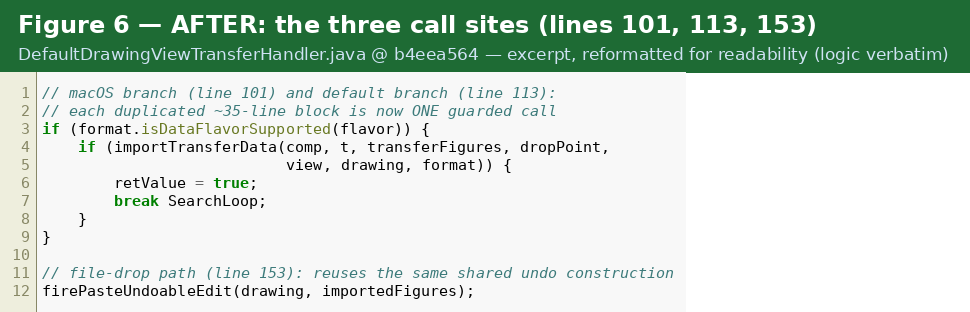

*Figure 6: After the refactoring, each duplicated block is a single guarded call (sites at lines 101, 113, 153).*
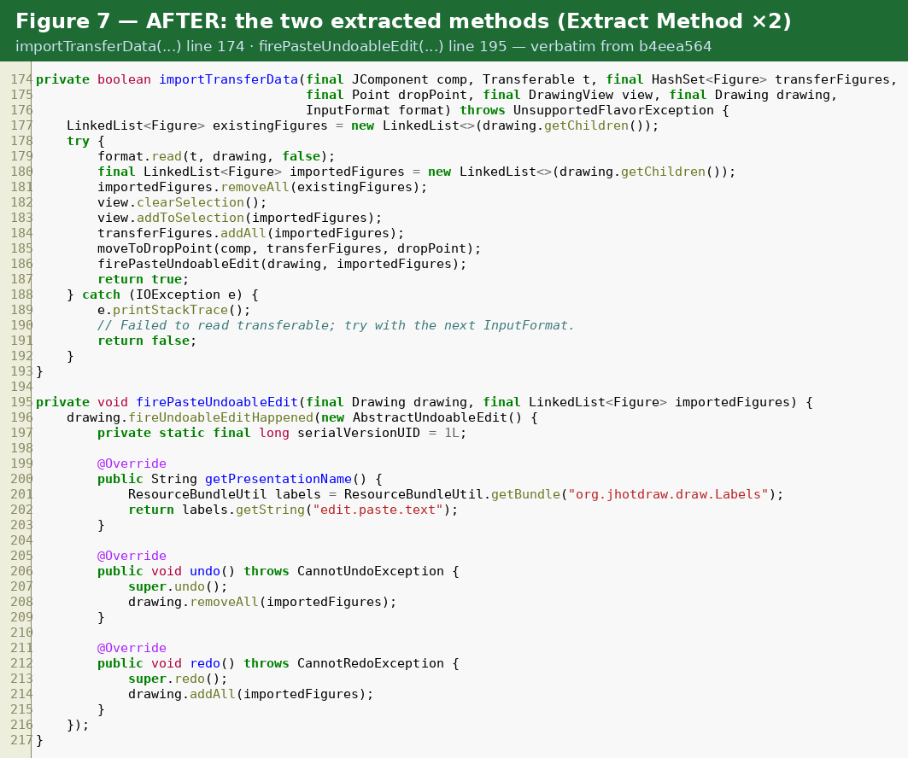

*Figure 7: The extracted methods importTransferData(...) (line 174) and firePasteUndoableEdit(...) (line 195), verbatim from b4eea564.*

The net effect on the primary file is −49 lines (625 → 576) with 147 lines changed. The only other production file touched is `CompositeTransferable` (JavaDoc corrections, `final` fields). The remainder of the commit adds three test classes and the portfolio documentation (`BobsWork/`, `bob/docs/`). The change is behaviour-preserving by intent — a refactoring — and the characterisation tests committed alongside it pin the externally observable behaviour: figure counts, selection state, deep-copy semantics, and undo/redo of paste.

**Actual change set vs. estimated impact set:** they matched almost exactly. The estimate flagged the handler (changed), `CompositeTransferable` (documentation), and possibly the three action classes; the actual change is the handler plus the documentation fix. Propagation into the action classes was *deliberately declined*, even though the smell is real, to keep the change small, reviewable and low-risk right before the deadline — that duplication went back into the backlog as a follow-up change request instead. The actual set is a strict subset of the estimated set, with zero surprises outside it — a sign the analysis was done at the right depth.

**Design patterns preserved deliberately:** `InputFormat`/`OutputFormat` are a Strategy — `importTransferData` works against the strategy interface, never a concrete format, so paste remains open for extension. `CompositeTransferable` is a Composite of transfer formats. `CopyAction`/`PasteAction` follow the Command pattern, and the anonymous `AbstractUndoableEdit` that `firePasteUndoableEdit` constructs is itself a Command with explicit undo/redo, delivered to the undo manager through the Observer-style `fireUndoableEditHappened` event.

**Responsibility boundaries after the change** (from the committed actualization artefact, `BobsWork/08_ActualizationLab_Copy_Paste.md`):

| Boundary | Responsibility |
| --- | --- |
| Actions | Resolve target component and delegate to Swing transfer handling. |
| Transfer handler | Export selected figures, import supported clipboard data, update selection, move dropped figures, and fire paste undo edits. |
| Drawing model | Own figures and registered input/output formats. |
| Input/output formats | Read and write specific clipboard/file data formats. |
| Clipboard utilities | Provide platform-aware clipboard access. |

*Table 4a: Responsibility boundaries — the refactoring keeps copy/paste a composite feature while improving the local structure of the central handler. No menu, toolbar, shortcut, or action wiring needed to change.*

### 6.3 SOLID principles in context

#### 6.3.1 Single Responsibility Principle

The command layer respects SRP well: `CopyAction`'s only reason to change is the definition of "what copy means as a menu command"; serialisation lives in the formats and clipboard handling in `jhotdraw-datatransfer`. The violation sat in `DefaultDrawingViewTransferHandler`, which combined format negotiation, platform workarounds, selection updates, drop-point geometry, and undo construction in one method. The performed extraction moves the class toward one responsibility per method: format negotiation remains in `importData(...)`, the import transaction lives in `importTransferData(...)`, and undo construction lives in `firePasteUndoableEdit(...)`.

#### 6.3.2 Open–Closed Principle

The work area is a strong positive example of OCP. New clipboard formats are added by registering `InputFormat`/`OutputFormat` strategies on the drawing without touching the handler (Snippet 3). The committed test suite demonstrates this property *executably*: `CopyPasteBddTest` registers a `TextInputFormat` on a drawing and shows that pasting plain text then yields a `TextHolderFigure` — extended paste behaviour with zero modification of the handler.

#### 6.3.3 Liskov Substitution Principle

The actions are written against the abstractions `JComponent`, `TransferHandler`, and `Clipboard`, and any drawing view can substitute `DefaultDrawingView` behind the `DrawingView` interface. The clipboard hierarchy (`AbstractClipboard` with `AWTClipboard`, `OSXClipboard`, `JNLPClipboard`) is substitutable by construction — `ClipboardUtil` silently swaps implementations depending on the environment, and clients cannot tell the difference. The tests exploit the same property: `ExposedTransferHandler` is a behavioural subtype of `DefaultDrawingViewTransferHandler` that merely widens visibility, and the production code under test cannot distinguish it.

#### 6.3.4 Interface Segregation Principle

`EditableComponent` is a small, role-specific interface (delete, duplicate, selectAll, clearSelection, isSelectionEmpty plus listener registration), so clients such as `DuplicateAction` depend only on the editing role of a component rather than on all of `DefaultDrawingView`. The interface's own FIXME (line 16) notes a possible future consolidation with the TransferHandler mechanism; until then the segregation is adequate.

#### 6.3.5 Dependency Inversion Principle

High-level policy (the actions in `jhotdraw-actions`) depends on abstractions: the `EditableComponent` contract is defined in the separate `jhotdraw-api` module, and serialisation is reached only through the `InputFormat`/`OutputFormat` interfaces — the new tests inject `DOMStorableInputOutputFormat` and `TextInputFormat` through exactly this seam. The main DIP deviation is the concrete static dependency on `ClipboardUtil` inside the actions; the injection seam `setClipboard(...)` (line 62) limits the practical damage, and full constructor injection is recorded as future work to avoid rippling through the framework.

---

## 7. Postfactoring

Postfactoring evaluates the structure after the change and cleans up what actualization left behind. After commit `b4eea564`, `DefaultDrawingViewTransferHandler` retains its Swing `TransferHandler` contract unchanged (public `importData` and `getSourceActions`, protected `createTransferable` and `exportDone` at line 315), while the import algorithm decomposes into `importData(...)` for format negotiation, `importTransferData(...)` for the import transaction, and `firePasteUndoableEdit(...)` for undo construction — the structure targeted by the Stepdown Rule. The structural improvement is that the variation points are now explicit: before, "what happens on a successful import" was smeared over three copies; now it is one named method that reads top-down, so a future change is a one-place change.

In SOLID terms the change is conservative by design: the OCP, LSP, ISP, and DIP characteristics described in Section 6.3 are preserved, and SRP improves at method level. The honest residuals are recorded in Table 3: the macOS/default loop scaffolding still exists twice (only its body was consolidated) and `importData`'s nested search loops retain high cyclomatic complexity; `importTransferData(...)` carries seven parameters (Introduce Parameter Object candidate); the doubled `drawing.removeAll(selectedFigures)` (lines 344/346) and the commented-out `// view.clearSelection();` (line 332) are still present; and exceptions are still printed to the console. The handler is still a large integration class — it was not split — but every duplicated piece of paste behaviour now has exactly one home, and the committed tests make the *next* refactoring of this class substantially cheaper than this one was.

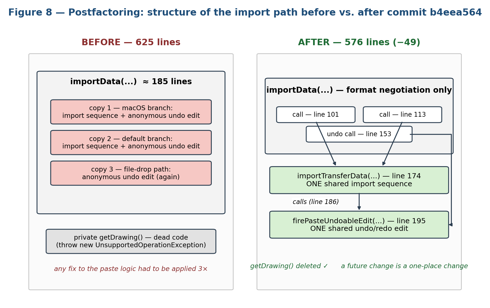

*Figure 8: Side-by-side structure of the import path — one ~185-line importData with three duplicated copies and a dead method (before) vs. format negotiation plus two shared, named helpers (after).*

**Old vs. new structure (textual comparison):**

| | Before (parent of `b4eea564`) | After (`b4eea564`) |
| --- | --- | --- |
| File length | 625 lines | 576 lines (−49) |
| `importData` | ~185 lines, import body duplicated 3× | format negotiation only; 3 one-line guarded calls |
| Import transaction | inline, 3 copies | `importTransferData(...)` (line 174), 1 copy |
| Undo construction | inline anonymous class, 3 copies | `firePasteUndoableEdit(...)` (line 195), 1 copy |
| Dead code | private `getDrawing()` throwing `UnsupportedOperationException` | deleted |
| `CompositeTransferable` | "ComoositeTransferable", "wjether", mutable fields | correct JavaDoc, `final` fields |

*Table 4: Structure before and after the change.*

**Technical debt observed beyond the work area** (recorded in `bob/docs/portfolio/09-conclusion-and-technical-debt.md`): the transfer handler still mixes paste, drag/drop, file import, and undo behaviour; exception handling often prints stack traces directly; some legacy/deprecated APIs surface during compilation; full GUI-level copy/paste remains hard to test without Swing integration helpers; and the SVG sample launch emitted resource warnings for missing icons. The documented future improvements are: a clipboard-level test using `ClipboardUtil.setClipboard(...)`, a higher-level Swing/UI test that drives menu or keyboard Copy/Paste, logging instead of stack-trace printing, and separating drag/drop file import from clipboard paste coordination if the class grows further.

---

## 8. Verification

Verification confirms that the behaviour of the work area matches the change request, both before refactoring (characterisation) and after (regression). The part of the code under test is the core feature logic identified by concept location: `DefaultDrawingViewTransferHandler` (export/import/undo) and the `DOMStorableInputOutputFormat` serialisation it depends on. Commit `b4eea564` adds three test classes under `jhotdraw-samples/jhotdraw-samples-misc/src/test/java/org/jhotdraw/samples/draw/`:

- `DefaultDrawingViewTransferHandlerTest` — 176 lines, 5 tests;
- `CopyPasteBddTest` — 143 lines, 5 BDD scenario tests;
- `DOMStorableInputOutputFormatTest` — 73 lines, 3 round-trip tests.

The tests use JUnit 4.13.2, the framework declared in the module's `pom.xml`. They are placed in the samples module because it contributes `DrawFigureFactory` and the concrete `RectangleFigure`/`TextHolderFigure` needed for realistic fixtures.

### 8.1 Unit testing: fixture, seams, and assertions

The test design avoids the operating-system clipboard entirely: where the real clipboard would have made tests flaky and CI-hostile, crafted `Transferable` objects are passed directly to `importData(...)` — stubbing the clipboard — which makes the suite deterministic and runnable headless. Two test doubles provide the seams. `ViewFixture` assembles a `DefaultDrawing` with a registered DOM input/output format and a `DefaultDrawingView` with the handler installed — the same object graph the application uses, minus the window system. `ExposedTransferHandler` is a test-specific subclass that widens the protected `createTransferable(...)` so the export path can be driven without a focused Swing component — a subclass-to-test seam rather than a mock, appropriate because the collaborators are value-oriented.

```java
// DefaultDrawingViewTransferHandlerTest.java — fixture (line 128)
private static class ViewFixture {
    private final ExposedTransferHandler handler = new ExposedTransferHandler();
    private final DOMFormatWithFlavor format = new DOMFormatWithFlavor();
    private final DefaultDrawing drawing = new DefaultDrawing();
    private final DefaultDrawingView view = new DefaultDrawingView();
    ViewFixture() {
        drawing.addInputFormat(format);
        drawing.addOutputFormat(format);
        view.setTransferHandler(handler);
        view.setDrawing(drawing);
    }
}
```

*Snippet 6: The fixture wires a real drawing, view, format, and handler.*

```java
// pasteSupportedTransferableAddsAndSelectsImportedFigure() (line 61)
ViewFixture source = new ViewFixture();
RectangleFigure original = new RectangleFigure(10, 20, 30, 40);
source.drawing.add(original);
source.view.addToSelection(original);
Transferable transferable = source.handler.createTransferable(
        source.view, source.view.getSelectedFigures());

ViewFixture target = new ViewFixture();
boolean imported = target.handler.importData(target.view, transferable);

assertTrue(imported);
assertEquals(1, target.drawing.getChildCount());
Figure pasted = target.drawing.getChild(0);
assertTrue(pasted instanceof RectangleFigure);
assertNotSame(original, pasted);                       // deep copy, not aliasing
assertBoundsEqual(original.getBounds(), pasted.getBounds());
assertEquals(1, target.view.getSelectionCount());
assertTrue(target.view.isFigureSelected(pasted));
```

*Snippet 7: The central copy→paste test asserts on the model: the pasted figure is a distinct object with equal bounds, and the selection has moved to it.*

`pasteFiresUndoableEditThatCanUndoAndRedoImportedFigure` (line 96) attaches a `javax.swing.undo.UndoManager` to the drawing, pastes, and asserts `canUndo()`; after `undo()` the child count returns to zero and after `redo()` to one — directly verifying the edit constructed in `firePasteUndoableEdit(...)`.

**Verification discipline:** the full suite was run *before* the refactoring to establish green on the original behaviour, the refactoring was performed in small steps, and the suite re-run after each step. The same scenarios green before and after is what actually demonstrates behaviour preservation — regression testing in action. A manual check in the running Draw sample (copy a rectangle, paste, undo, redo through the real menus, shortcuts, and clipboard) covered the GUI path the headless suite intentionally avoids.

On the underlying concepts: *unit testing* exercises the smallest meaningful units in isolation, automatically and repeatably — it documents intended behaviour as executable examples. *Inspection* (code review on the pull request) is humans reading artifacts without executing them; *testing* executes the product against expected outcomes — they complement each other. *Regression testing* re-runs an existing suite after a change to confirm previously working behaviour still works — exactly the risk of a refactoring, and why the "before" run is essential: without it, a green "after" run proves nothing about preservation. The unit tests here are white-box (they inject transferables directly into the handler); the BDD acceptance scenarios below are black-box — they express the user story and would still be valid if the entire handler were rewritten.

### 8.2 Boundary cases and best case

- **Best case:** one selected figure, copy then paste — `pasteSupportedTransferableAddsAndSelectsImportedFigure` (Snippet 7) and its undo/redo sibling.
- **Empty selection:** `copyWithoutSelectionCreatesNoTransferable` asserts `createTransferable(...)` returns null when nothing is selected, matching the guard `toBeCopied.size() > 0` in the production code (Snippet 3).
- **Unsupported clipboard content:** `pasteUnsupportedTransferableLeavesDrawingUnchanged` pastes a `StringSelection` into a DOM-only drawing and asserts `importData` returns false with child count and selection unchanged.
- **Format round-trip:** `DOMStorableInputOutputFormatTest` verifies a figure exported and re-imported keeps its bounds, that `read(..., replace=true)` clears existing figures first, and that an unsupported data flavor is rejected.
- **Format extension:** the `TextInputFormat` scenario shows the same paste gesture succeeding once a text-capable format is registered — the boundary between "unsupported" and "supported" is exactly one format registration (the executable OCP demonstration of Section 6.3.2).
- **Cut + undo:** not yet covered by a dedicated test; planned as the guard for removing the doubled `removeAll(...)` in `exportDone(...)` (Table 3).

### 8.3 BDD scenarios

Behaviour-driven testing connects the user stories of initiation directly to executable scenarios in Given–When–Then form (BDD Lab; North, *Introducing BDD*). The committed `CopyPasteBddTest` encodes the scenarios in the BDD naming convention `given…_when…_then…`, so each test name reads as a scenario title and the method body realises its three clauses. **JGiven**, the stage-based BDD tool introduced in the lab, structures scenarios as reusable Given/When/Then stage classes and generates HTML scenario reports; it is not declared as a dependency in the inspected repository — the naming-convention approach was chosen as the pragmatic alternative requiring no new dependency, and migrating the scenarios onto JGiven stages is documented as planned. The template-mandated two-column mapping from user story to scenario:

| User story | BDD scenario (test method in `CopyPasteBddTest`) |
| --- | --- |
| As a user, I want to copy a selected figure and paste it back, so that I can reuse elements of my drawings. | `givenDrawingWithOneSelectedRectangle_whenUserCopiesAndPastesIt_thenDrawingContainsTwoRectanglesAndPastedRectangleIsSelected` |
| (boundary) Copying must be safe when nothing is selected. | `givenDrawingViewWithNoSelectedFigures_whenUserInvokesCopy_thenNoDrawingFigureTransferableIsProduced` |
| (boundary) Pasting must be safe when the clipboard holds unsupported data. | `givenClipboardContainsUnsupportedData_whenUserInvokesPaste_thenDrawingRemainsUnchanged` |
| Paste must be undoable and redoable. | `givenUserPastedFiguresIntoDrawing_whenUserInvokesUndoAndRedo_thenPastedFiguresAreRemovedAndAddedBack` |
| (extension) Pasting plain text yields a text figure when the drawing accepts text. | `givenClipboardContainsPlainTextAndDrawingRegistersTextInputFormat_whenUserInvokesPaste_thenTextHolderFigureIsAdded` |

*Table 5: User stories mapped to the committed BDD scenarios.*

### 8.4 Test execution results

The suite was executed on 11 June 2026 against the head of the branch with `mvn -pl jhotdraw-samples/jhotdraw-samples-misc -am test` (headless):

```text
Running org.jhotdraw.samples.draw.DefaultDrawingViewTransferHandlerTest
Tests run: 5, Failures: 0, Errors: 0, Skipped: 0
Running org.jhotdraw.samples.draw.CopyPasteBddTest
Tests run: 5, Failures: 0, Errors: 0, Skipped: 0
Running org.jhotdraw.samples.draw.DOMStorableInputOutputFormatTest
Tests run: 3, Failures: 0, Errors: 0, Skipped: 0

Tests run: 13, Failures: 0, Errors: 0, Skipped: 0 — BUILD SUCCESS
```

*Snippet 8: Executed result of the verification suite (5 handler characterisation tests + 5 BDD scenarios + 3 format round-trip tests).*

The same result is recorded in the committed test artefacts (`BobsWork/09_TestLab1_Copy_Paste.md`, `BobsWork/10_BDDLab_Copy_Paste.md`, and the TestLab chapter of `BobsWork/Portfolio_Copy_Paste.md`), which document the verification commands `mvn -pl jhotdraw-core,jhotdraw-datatransfer -am test` (focused run after the refactoring) and `mvn -pl jhotdraw-samples/jhotdraw-samples-misc test` (the 13-test suite), both ending in `BUILD SUCCESS`.

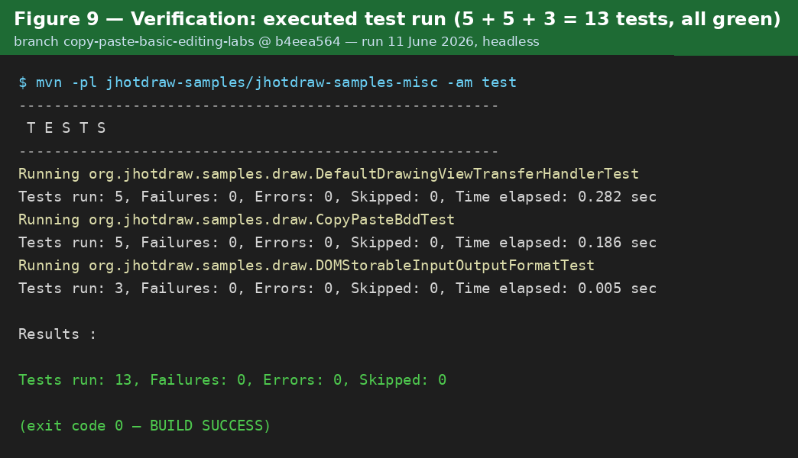

*Figure 9: The executed test run — 5 + 5 + 3 = 13 tests, 0 failures (branch head b4eea564, 11 June 2026, headless).*

---

## 9. Continuous Integration

Continuous integration is "the practice of merging all developers' working copies to a shared mainline several times a day" (CI Lab; [Fow06]), where every integration is verified by an automated, self-testing build on a neutral build server. The team fork has a working CI setup based on GitHub Actions, created by the team itself: the develop history contains the setup series `c84f39ca` ("set up CI"), `f40d9db1`/`59f5ccb0`/`56ab3bda` ("github tokens correct" 1–3), `f03c6169` ("fix"), and the iteration commits `19d31058`/`de970e07`/`64e654f8` ("pls work" 1–3) — an honest record of pipeline debugging. The resulting workflow `.github/workflows/maven.yml`:

```yaml
name: Java CI with Maven
on:
  push:         { branches: [ "develop" ] }
  pull_request: { branches: [ "develop" ] }
jobs:
  build:
    runs-on: ubuntu-latest
    steps:
    - uses: actions/checkout@v4
    - name: Set up JDK 23
      uses: actions/setup-java@v4
      with: { java-version: "23", distribution: temurin, cache: maven }
    - name: Configure GitHub Packages credentials
      run: |  # writes ~/.m2/settings.xml with GITHUB_ACTOR / GITHUB_TOKEN
    - name: Build entire project with Maven
      run: mvn -B clean install --file pom.xml
    - name: Run tests
      run: mvn test --file pom.xml
```

*Snippet 9: The team's CI workflow (credentials step condensed; the repository file uses block YAML).*

The pipeline runs on every push and every pull request targeting `develop`, on Temurin JDK 23 with a Maven cache; it builds the whole multi-module project and runs the test suite in an explicit `mvn test` step. This matters for this feature specifically because copy/paste spans six Maven modules (`jhotdraw-actions`, `jhotdraw-datatransfer`, `jhotdraw-core`, `jhotdraw-app`, `jhotdraw-gui`, `jhotdraw-samples`): the CI build compiles and tests all of them on every integration, so a "small" refactoring in `jhotdraw-core` cannot silently break a neighbouring module. The Copy/Paste tests committed in `b4eea564` are wired into the standard Maven lifecycle and run headless (thanks to the clipboard-stubbing decision), so they will be executed by the pipeline as soon as the branch is opened as a pull request against `develop`.

Two honest observations: first, because the workflow triggers only on `develop`, pushes to the feature branch itself are not built — adding the feature branch (or `branches: ["**"]`) to the push trigger would give earlier feedback; second, no static-analysis step (e.g. Checkstyle) is present — the history even shows the upstream checkstyle plugin being removed (`df6a8256`) — so adding one is an open pipeline improvement.

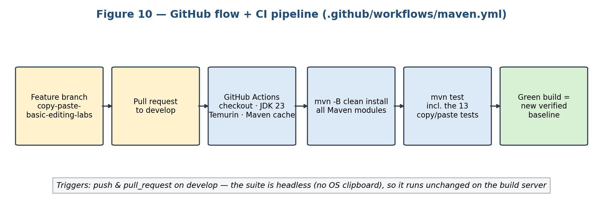

*Figure 10: The team pipeline — feature branch → pull request to develop → GitHub Actions build (JDK 23, mvn clean install, mvn test) → green build as the new verified baseline.*

---

## 10. Conclusion

This report enacted the phased model of software change on the Copy/Paste functionality of JHotDraw's basic editing feature, on the team fork JakubPotocky/JHotDraw, branch `copy-paste-basic-editing-labs`. Initiation reconstructed the change request as user stories and fixed the task-level behaviour. Concept location traced the stories — via grep, dependency search, and debugger confirmation — to a small command layer (`CopyAction`, `CutAction`, `PasteAction` over `AbstractSelectionAction`), a clipboard abstraction (`ClipboardUtil` and its platform proxies), and a single feature-logic hotspot, `DefaultDrawingViewTransferHandler`, wired into every view by `DefaultDrawingView`. Impact analysis grew the initial set of seven classes into an estimated impacted set spanning 9 packages / 35 classes — an estimate that actualization then confirmed as a safe over-approximation, since only two production classes were ultimately modified, and the actual change set was a strict subset of the estimate.

The main lesson about maintaining Copy/Paste is that its risk concentrated in one long import method whose body was triplicated across a macOS path, a default path, and a file-drop path. The performed change, commit `b4eea564`, removed exactly this risk: Extract Method (applied twice, after explicitly rejecting Form Template Method and Extract Composite as mismatched to within-class duplication) produced `importTransferData(...)` and `firePasteUndoableEdit(...)`, the dead `getDrawing()` method was deleted, the file shrank from 625 to 576 lines — and, decisively, the change was committed together with the tests that pin the behaviour: five characterisation tests on the handler, five BDD scenarios mapping one-to-one onto the user stories, and three format round-trip tests. The test design (a real-object fixture plus a visibility-widening subclass, no system clipboard) keeps the suite deterministic and headless; the executed run is green: `Tests run: 13, Failures: 0, Errors: 0, Skipped: 0`.

With respect to maintainability, the change is conservative: the Swing `TransferHandler` contract is preserved, the OCP/LSP/ISP/DIP characteristics of the design are kept (the OCP claim demonstrated executably by the TextInputFormat scenario), and SRP improves at method level. The system was verified at three levels: component-level unit tests, automated BDD acceptance scenarios derived from the user stories, and a manual session in the running Draw sample covering the full GUI path. The honest residuals — the doubled `removeAll(...)` in the cut path, the console-based error handling, the action-layer duplication, and the seven-parameter helper — are recorded as planned, backlog work with concrete strategies.

---

## 11. Discussion

**What could have been better.** First, the verification story stops one step short of pipeline evidence: the tests exist, are committed, and run green locally, but because the CI workflow triggers only on `develop` and the pull request had not yet been opened at inspection time, there is no citable CI run for this branch. Opening the pull request — or extending the workflow trigger to feature branches — is the cheapest available improvement. Second, the cut path is under-tested relative to the paste path: the doubled `removeAll(...)` cannot be safely deleted until a cut-plus-undo characterisation test exists, so that planned test should have been part of `b4eea564`. Third, the extraction traded one smell for a smaller one: `importTransferData(...)` takes seven parameters, and an ImportContext parameter object would have completed the clean-up within the same commit. Fourth, the report's runtime evidence (debugger screenshots, UML exports) must be inserted at the marked figure placeholders before submission — an image describes a thousand words, and the template explicitly rewards it.

**What failed, and mitigation.** First, early attempts at testing against the real system clipboard were flaky — results depended on the host machine and whatever other processes did with the clipboard — and time was lost before accepting that the OS clipboard does not belong in an automated suite; the mitigation was passing crafted `Transferable` objects directly to the handler, which paid off twice (deterministic local tests, zero headless problems in CI). The alternative — stubbing `ClipboardUtil` through its `setClipboard(...)` seam — remains available for future action-level tests. Second, the effort needed to read a "simple" feature was underestimated — 35 classes across 9 packages for copy/paste — though that effort converted directly into the concept-location and impact tables. Third, the team's CI history ("github tokens correct" 1–3, "pls work" 1–3) records a real struggle with GitHub Packages authentication; the mitigation that worked was generating `~/.m2/settings.xml` inside the workflow from the built-in `GITHUB_TOKEN`; vendoring the dependencies or switching to Maven Central only was rejected to keep the fork's dependency setup intact. Fourth, a JGiven-based BDD layer was considered but not adopted; the naming-convention approach required no new dependency, at the cost of losing JGiven's generated scenario reports.

**Scope was cut once, deliberately.** Impact analysis revealed that `CopyAction`, `CutAction` and `PasteAction` share an almost identical focused-component lookup — a real Duplicated Code smell in a second location. Fixing it would mean touching their common base class, widening the change set and the blast radius, so it went back into the backlog as a follow-up change request rather than letting the scope creep. The lessons: keep the changed set as small as the smell allows and resist propagating "while I'm here" fixes; never refactor without a green suite first, because the before-run is what gives the after-run meaning; design tests for the CI environment from the start (headless, no OS resources); and trust the impact analysis to draw the scope line — the backlog is the right home for everything outside it.

---

## References & Sources

[1] V. Rajlich, *Software Engineering: The Current Practice*. New York, NY, USA: ACM, 2013.
[2] R. C. Martin, *Clean Code: A Handbook of Agile Software Craftsmanship*. Upper Saddle River, NJ, USA: Prentice Hall, 2008.
[3] M. Fowler, *Refactoring: Improving the Design of Existing Code*, 2nd ed. Boston, MA, USA: Addison-Wesley, 2018.
[4] J. Kerievsky, *Refactoring to Patterns*. Boston, MA, USA: Addison-Wesley, 2005.
[5] M. Fowler, "Continuous Integration," 2006. [Online]. Available: https://martinfowler.com/articles/continuousIntegration.html
[6] D. North, "Introducing BDD," 2006. [Online]. Available: https://dannorth.net/introducing-bdd/
[7] E. Gamma, R. Helm, R. Johnson, and J. Vlissides, *Design Patterns: Elements of Reusable Object-Oriented Software*. Boston, MA, USA: Addison-Wesley, 1994.
[8] W. Randelshofer, "The JHotDraw 7 Handbook," 2011.
[9] J. Schäfer, "JGiven — Behavior-Driven Development in plain Java," 2016. [Online]. Available: https://jgiven.org
[10] J. C. Sørensen, Software Maintenance (SB-MAI) course material: lecture slides and lab descriptions (IntroLab, ChangeReqLab, CLLab, AnalysisLab, RefactLab, ActLab, TestLab1, TestLab2/BDD, CILab), SDU.
[11] Team fork repository: JakubPotocky/JHotDraw. [Online]. Available: https://github.com/JakubPotocky/JHotDraw — branch `copy-paste-basic-editing-labs`, head commit `b4eea56487ea289d6c1855d9ba32150e16b31366` (inspected 11 June 2026); forked from wumpz/jhotdraw.
[12] In-repository lab and portfolio documentation, committed in `b4eea564`: `BobsWork/02_ChangeReqLab_Copy_Paste.md` … `BobsWork/10_BDDLab_Copy_Paste.md`, `BobsWork/Portfolio_Copy_Paste.md`, `bob/Labs.md`, and `bob/docs/` (exercise notes 01–09, portfolio chapters 01–09, `coverage-matrix.md`, `theory-recap.md`).

---

## Appendix

### A. Repository evidence index

| Artefact | Path / reference | Used in section |
| --- | --- | --- |
| `CopyAction.java` | `jhotdraw-actions/src/main/java/org/jhotdraw/action/edit/CopyAction.java` | 2.4, 3 (Snippet 2), 5.1.3 |
| `CutAction.java` / `PasteAction.java` | same package; focus lookup at lines 60–62 / 61–63 | 3, 5.1.3 |
| `AbstractSelectionAction.java` | same package; `SELECTION_EMPTY_PROPERTY` listener | 3, 5.4 |
| `EditableComponent.java` | `jhotdraw-api/src/main/java/org/jhotdraw/api/gui/EditableComponent.java` (FIXME line 16) | 3, 5.1.7, 6.3.4 |
| `ClipboardUtil.java` | `jhotdraw-datatransfer/.../datatransfer/ClipboardUtil.java` (`setClipboard` line 62) | 3, 6.3.5 |
| `CompositeTransferable.java` | `jhotdraw-datatransfer/.../datatransfer/CompositeTransferable.java` — modified in `b4eea564` (typos fixed, fields `final`) | 5.1.6, 6.2 |
| `DefaultDrawingViewTransferHandler.java` | `jhotdraw-core/src/main/java/org/jhotdraw/draw/DefaultDrawingViewTransferHandler.java` — 576 lines; helpers at 174/195; call sites 101/113/153; commented-out clearSelection 332; doubled removeAll 344/346; printStackTrace 165/189/304/422 | 3, 5, 6, 7 |
| `DefaultDrawingView.java` | `jhotdraw-core/.../draw/DefaultDrawingView.java` (handler install line 305) | 3, 4.1, 6.1 |
| `DefaultApplicationModel` / `DefaultMenuBuilder` | `jhotdraw-app/.../app/` — `createActionMap(...)`; `addClipboardItems(...)` line 272 | 2.4, 3, 4.1 |
| Unit tests | `jhotdraw-samples/jhotdraw-samples-misc/src/test/java/org/jhotdraw/samples/draw/DefaultDrawingViewTransferHandlerTest.java` (176 lines, 5 tests; ViewFixture line 128, ExposedTransferHandler line 143) | 8.1–8.2 |
| BDD scenarios | `.../samples/draw/CopyPasteBddTest.java` (143 lines, 5 scenarios) | 8.3, 6.3.2 |
| Format tests | `.../samples/draw/DOMStorableInputOutputFormatTest.java` (73 lines, 3 tests) | 8.2 |
| Change commit | `b4eea564` "Copy/paste labs with tests and docs" — only commit on `copy-paste-basic-editing-labs` ahead of `develop`; 39 files, +3866/−102 | 2.5, 5.4, 6.2, 7, 8 |
| Team branches | `AlansBranch`, `feature/Image-Tool`, `feature/lab1`, `undo/redo`, `copy-paste-basic-editing-labs`; merge commit `ba1a91b0` | 2.5 |
| CI workflow & history | `.github/workflows/maven.yml`; commits `c84f39ca`, `f40d9db1`, `59f5ccb0`, `56ab3bda`, `f03c6169`, `19d31058`, `de970e07`, `64e654f8`, `df6a8256` | 9 |
| Lab artefacts (per phase) | `BobsWork/02_ChangeReqLab…` (user stories, acceptance criteria), `03_CLLab…` (breakpoint set, class table), `04_AnalysisLab1…` (impact sets, package table), `05_CILab…`, `06_RefactoringLab1…` (smell/refactoring tables), `08_ActualizationLab…` (change table, responsibility boundaries), `09_TestLab1…` / `10_BDDLab…` (test commands and results) | 2.3, 4.2, 5, 6, 8 |
| Portfolio documentation | `BobsWork/Portfolio_Copy_Paste.md` (consolidated chapters), `bob/Labs.md`, `bob/docs/portfolio/` 01–09 + `coverage-matrix.md` (maps every course item to its artefact) + `theory-recap.md`, `bob/docs/exercises/` 01–09 — all committed in `b4eea564` | source material throughout |

*Table 6: Index of repository evidence cited in this report.*

### B. Material to finalise before submission

- Figures 1–10 are embedded from `BobsWork/diagrams/` (`fig01`–`fig10`), generated from the verified repository state at `b4eea564`; the code in Figures 5–7 and the console output in Figure 9 are verbatim repository/test-run content. Optional substitutions at the exam: a live IDE debugger screenshot for Figure 3, and a green GitHub Actions screenshot for Figure 10 once the pull request is opened.
- Title-page fields: full name, exam number, lecturer email, final page count.

### C. Material not available in the inspected repository

- Pull request and CI run for branch `copy-paste-basic-editing-labs`: the workflow triggers only on `develop`, and no PR had been opened at inspection time — the test results in Section 8.4 are from a local execution against the branch head, not from a pipeline run.
- GitHub Projects backlog cards: not verifiable from the repository clone.
- JGiven dependency and generated BDD reports: not present; the committed scenarios use the Given–When–Then naming convention instead (Section 8.3).
- Remaining planned refactorings (Table 3): pull-up of focus resolution, removal of the doubled `removeAll(...)`, logging-based error handling, parameter object for `importTransferData(...)` — not present as commits.
