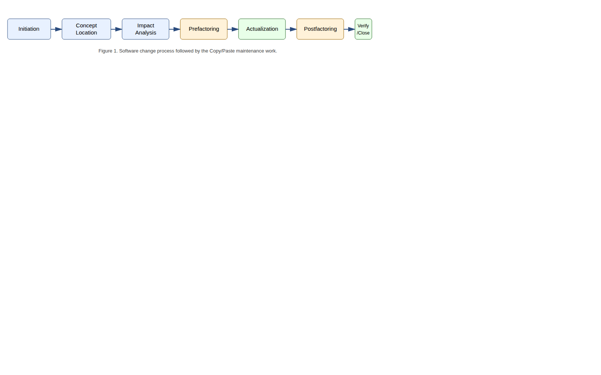
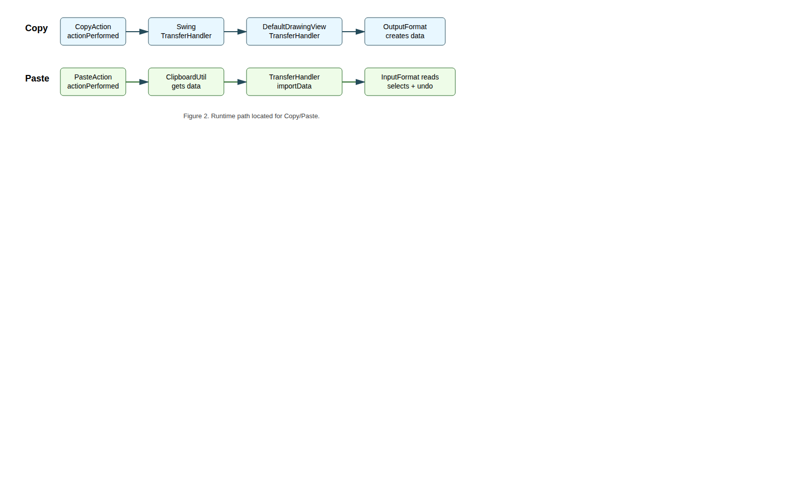
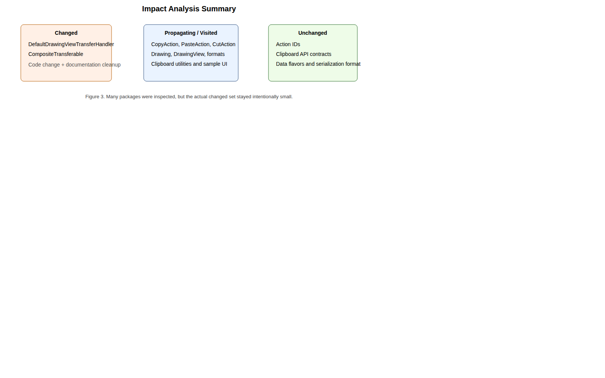
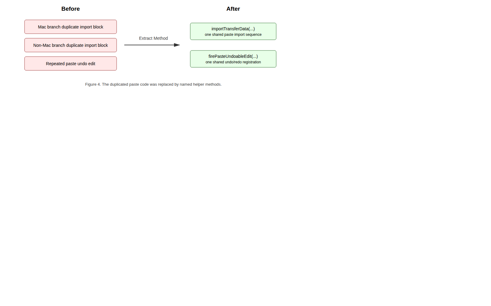
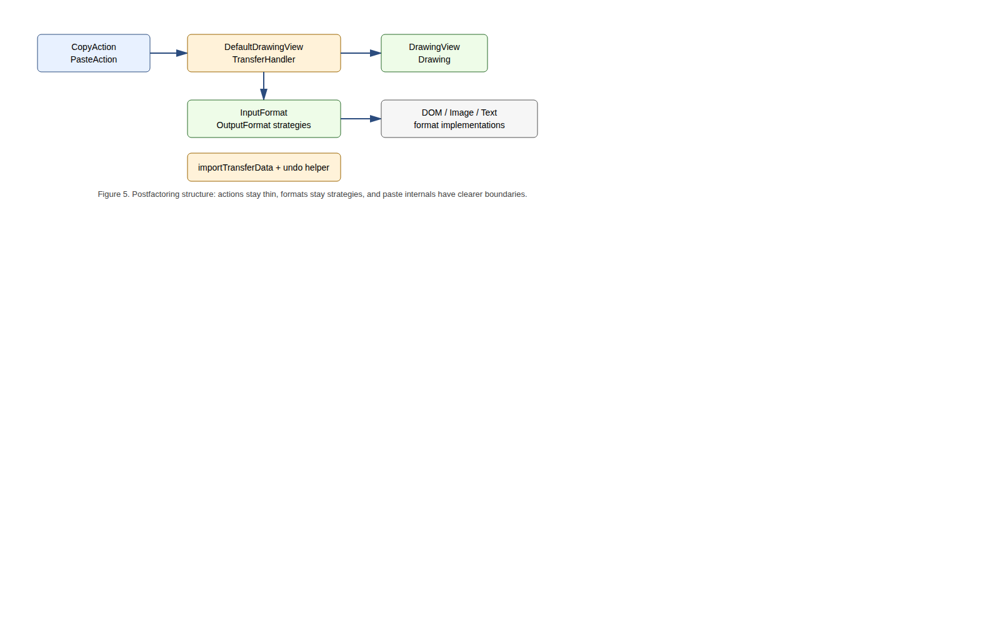
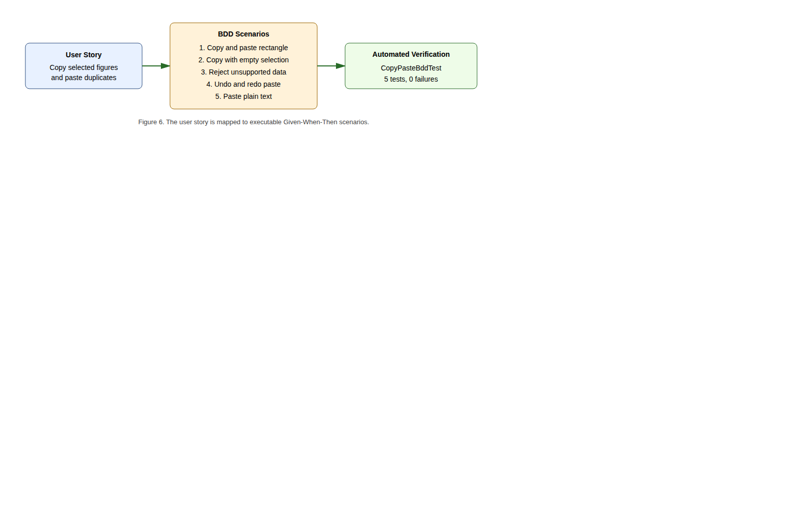

# Report Information

| Field | Value |
| --- | --- |
| Full name | [Fill in full name] |
| Student exam number | [Fill in exam number] |
| Student email | [Fill in student email] |
| Course number | SB5-MAI Software Maintenance, 5 ECTS |
| Lecturer | [Fill in lecturer name and email] |
| Repository | `https://github.com/JakubPotocky/JHotDraw` |
| Branch | `copy-paste-basic-editing-labs` |
| Inspected commit | `b4eea56487ea289d6c1855d9ba32150e16b31366` |
| Local checkout | `/home/bob/Desktop/university/softwareMaintenance/JHotDraw` |
| Number of pages | Update after final export |

<div class="pagebreak"></div>

# Abstract

This report is part of the 5 ECTS Software Maintenance course. The objective is to maintain an existing software project by locating a feature in unfamiliar code, analysing the impact of a change, removing bad code smells, improving internal structure, and verifying that behaviour is preserved.

The case study is JHotDraw, a Java/Swing drawing framework. The selected work area is Basic Editing Copy/Paste. Copy/Paste already existed in the repository, so this is preventive maintenance rather than a new feature. The implemented change removes duplicated paste-import logic from `DefaultDrawingViewTransferHandler`, extracts `importTransferData(...)` and `firePasteUndoableEdit(...)`, removes a dead private method, improves comments, and makes small documentation/immutability cleanup in `CompositeTransferable`.

Verification was added through 13 JUnit 4 tests, including 5 BDD-style Given-When-Then scenarios. Local Maven verification passed for both the sample module and the full reactor. The repository contains a GitHub Actions workflow for `develop` push/pull-request events, but no remote CI result for this feature branch was available from the inspected evidence. Therefore, this report claims local verification and CI readiness for PR integration, not an already merged or remotely green branch.

# Introduction

JHotDraw is a framework for building structured two-dimensional drawing editors. It is suitable for software maintenance because it is large enough to require real concept location: the maintainer must understand actions, Swing transfer mechanisms, clipboard wrappers, drawing views, figure models, and input/output formats before changing a simple-looking user feature.

The selected feature is Copy/Paste under Basic Editing. It was chosen because it is user-visible and central to a drawing editor, but technically spread across several layers. A user expects to select a figure, copy it, paste it back, and continue editing without manually recreating the same object.

| Layer | Copy/Paste role |
| --- | --- |
| Actions | `CopyAction`, `CutAction`, and `PasteAction` expose user commands. |
| Clipboard | `ClipboardUtil`, platform clipboards, and `CompositeTransferable` handle transfer data. |
| Swing transfer | `TransferHandler` performs component-level import/export. |
| Drawing view | `DefaultDrawingView` owns selection and installs the handler. |
| Transfer handler | `DefaultDrawingViewTransferHandler` performs the central copy/paste coordination. |
| Formats | `InputFormat` and `OutputFormat` decide which data formats can be read or written. |
| Model | `Drawing` and `Figure` are the copied and pasted domain objects. |

The maintenance objective was to improve this existing feature without changing its public behaviour: locate the implementation, identify a concrete code smell, refactor the duplicated paste path, and verify the result with automated tests.

# Initiation

## Software Change Process

The work follows the course software change process: initiation, concept location, impact analysis, prefactoring, actualization, postfactoring, verification, and conclusion.



The process matters because maintenance work can easily grow beyond the original request. Here, impact analysis was used to keep the change focused on the duplicated paste-import logic instead of rewriting adjacent action or GUI code.

## Change Request and User Story

The change request is:

> Maintain the existing JHotDraw Basic Editing Copy/Paste feature by improving maintainability and adding verification while preserving current user-visible behaviour.

The main user story is:

> As a user editing a drawing, I want to copy selected figures and paste them back into the drawing, so that I can duplicate existing work without recreating it manually.

Acceptance criteria:

| Requirement | Acceptance criterion |
| --- | --- |
| Copy selected figures | A selected figure can produce transferable drawing data. |
| Empty copy | Copy with no selected figures creates no drawing-figure transferable. |
| Paste supported data | Supported transfer data is imported into the active drawing. |
| Selection after paste | Pasted figures become selected. |
| Undoable paste | Undo removes pasted figures and redo restores them. |
| Unsupported data | Unsupported clipboard data is rejected safely. |
| Extensibility | Registered `InputFormat`/`OutputFormat` implementations continue to drive supported formats. |

## Team Pipeline

The work lives on the feature branch `copy-paste-basic-editing-labs`. The repository has a GitHub Actions workflow at `.github/workflows/maven.yml` that runs on pushes and pull requests targeting `develop`. It sets up Temurin JDK 23, caches Maven dependencies, builds with `mvn -B clean install --file pom.xml`, and runs `mvn test --file pom.xml`.

Important limitation: the workflow trigger is `develop`, not every feature-branch push. The local branch is not proven merged into `develop`, and no remote Actions success for commit `b4eea564` was available during inspection. This report therefore does not claim a merged PR or remote CI success for the branch.

# Concept Location

The objective of concept location is to map the words in the user story - copy, paste, clipboard, selected figure, drawing - to concrete code. The search started with grep/static search for `copy`, `paste`, `clipboard`, `Transferable`, `TransferHandler`, `InputFormat`, and `OutputFormat`, then followed dependencies from the action classes into the transfer handler and format strategies.



`CopyAction` and `PasteAction` were useful entry points, but they are thin controllers. `CopyAction` delegates export to Swing's `TransferHandler`; `PasteAction` gets clipboard contents through `ClipboardUtil` and delegates import to the focused component's transfer handler. In a drawing view, the installed handler is `DefaultDrawingViewTransferHandler`.

| Domain class | Responsibility |
| --- | --- |
| `CopyAction` | Entry point for Copy; delegates to `TransferHandler.exportToClipboard`. |
| `PasteAction` | Entry point for Paste; retrieves clipboard content and delegates to `TransferHandler.importData`. |
| `CutAction` | Related clipboard action using move/export behaviour. |
| `ClipboardUtil` | Provides system/fallback clipboard access. |
| `CompositeTransferable` | Combines several transfer flavours for one clipboard payload. |
| `DefaultDrawingView` | Drawing canvas; owns selection and installs the transfer handler. |
| `DefaultDrawingViewTransferHandler` | Core import/export coordinator for drawing views. |
| `Drawing` / `Figure` | Model and copied/pasted drawing objects. |
| `InputFormat` / `OutputFormat` | Strategy interfaces for reading/writing transfer data. |
| `DOMStorableInputOutputFormat` | Native JHotDraw figure transfer format in the Draw sample. |
| `TextInputFormat` | Supports text paste when registered on a drawing. |
| `DrawView` / `DrawingPanel` | Sample setup that registers formats and exposes actions. |

Concept-location conclusion: Copy/Paste is a framework collaboration, not one single method. The central class for the selected maintenance change is `DefaultDrawingViewTransferHandler`, because that is where the duplicated paste-import logic was found.

# Impact Analysis

The purpose of impact analysis is to estimate which files may be affected before changing code. For Copy/Paste, concept location visits many classes, but the safe changed set is small.



## Static Impact Analysis

The initial impact set included `CopyAction`, `PasteAction`, `DefaultDrawingViewTransferHandler`, `DefaultDrawingView`, `Drawing`, `InputFormat`, `OutputFormat`, `DOMStorableInputOutputFormat`, `ClipboardUtil`, and `CompositeTransferable`.

The public contracts did not need to change. The actions already delegate through Swing transfer APIs, and the handler already depends on abstractions such as `DrawingView`, `Drawing`, and `InputFormat`. Therefore, the actual code change could stay inside private helper structure.

## Dynamic Impact Analysis

The changed method `importTransferData(...)` is called from the paste `importData(...)` flow after a compatible `InputFormat` is found. The added tests exercise this path by creating real drawings, registering real formats, producing or crafting `Transferable` objects, and calling the real `DefaultDrawingViewTransferHandler.importData(...)`.

The tests avoid the operating-system clipboard because that would make CI unreliable, but they still exercise the changed handler logic.

## Package List

| Package | Classes visited | Comment |
| --- | ---: | --- |
| `org.jhotdraw.action.edit` | 5 | Copy, cut, paste, duplicate, selection actions. Unchanged. |
| `org.jhotdraw.api.gui` | 1 | Editable component contract. Unchanged. |
| `org.jhotdraw.draw` | 6 | Contains the changed transfer handler. |
| `org.jhotdraw.draw.figure` | 3 | Figure abstractions and concrete figures. Unchanged. |
| `org.jhotdraw.draw.io` | 7 | Input/output format strategies. Unchanged. |
| `org.jhotdraw.datatransfer` | 7 | Clipboard/transfer wrappers; `CompositeTransferable` cleaned. |
| `org.jhotdraw.app` | 2 | Menu/application integration. Unchanged. |
| `org.jhotdraw.gui.action` | 1 | Toolbar/popup action registration. Unchanged. |
| `org.jhotdraw.samples.draw` | 3 | Draw sample setup and test fixtures. Tests added. |

Actual production changed files:

```text
jhotdraw-core/src/main/java/org/jhotdraw/draw/DefaultDrawingViewTransferHandler.java
jhotdraw-datatransfer/src/main/java/org/jhotdraw/datatransfer/CompositeTransferable.java
```

# Prefactoring

Prefactoring prepares the code for change. In this project, the maintenance change itself is a refactoring, so Clean Code concepts were applied directly to the work area.

The main smell was Duplicated Code in `DefaultDrawingViewTransferHandler.importData(...)`. The method has Mac and non-Mac search branches because the Apple JVM historically ordered data flavours differently. That difference is valid, but both branches repeated the same successful-import sequence:

1. snapshot existing figures;
2. read the transferable into the drawing;
3. compute imported figures;
4. clear selection;
5. select imported figures;
6. add imported figures to the transfer set;
7. move to drop point if needed;
8. fire paste undoable edit.

The file-list branch also repeated undo-edit construction. Other smells were a dead private `getDrawing()` method, noisy comments, and Javadoc typos in `CompositeTransferable`.



| Smell | Refactoring |
| --- | --- |
| Duplicated import transaction | Extracted `importTransferData(...)`. |
| Duplicated undo construction | Extracted `firePasteUndoableEdit(...)`. |
| Dead code | Removed unused private `getDrawing()`. |
| Misleading/noisy comments | Rewrote comments to explain intent. |
| Documentation typos | Fixed `CompositeTransferable` Javadoc. |
| Never-reassigned fields | Declared `CompositeTransferable` collections `final`. |

## Clean Code Concepts

**Meaningful names:** `importTransferData(...)` and `firePasteUndoableEdit(...)` name the work that used to be hidden in repeated blocks.

**Functions and the Stepdown Rule:** `importData(...)` now reads at a higher level: search for a supported format, try the import, and stop on success. The lower-level details live in helper methods.

**Comments:** Comments now explain intent, for example why a failed read should try the next format.

**Formatting:** Extracted methods improve vertical openness by separating responsibilities, while related operations stay vertically close inside the import transaction.

# Actualization

Actualization incorporates the change into the existing system. Since this is preventive maintenance, public behaviour and architecture were preserved.

| Area | After actualization |
| --- | --- |
| Actions | `CopyAction` and `PasteAction` still delegate to Swing transfer handling. |
| Transfer handler | `DefaultDrawingViewTransferHandler` still coordinates import/export. |
| Format strategies | `InputFormat` and `OutputFormat` remain the extension points. |
| Domain model | `Drawing` and `Figure` still represent the model. |
| Clipboard infrastructure | `ClipboardUtil` and `CompositeTransferable` remain infrastructure. |

The important production change is:

```java
if (format.isDataFlavorSupported(flavor)) {
    if (importTransferData(comp, t, transferFigures, dropPoint, view, drawing, format)) {
        retValue = true;
        break SearchLoop;
    }
}
```

The helper method now owns the import transaction:

```java
format.read(t, drawing, false);
final LinkedList<Figure> importedFigures = new LinkedList<>(drawing.getChildren());
importedFigures.removeAll(existingFigures);
view.clearSelection();
view.addToSelection(importedFigures);
transferFigures.addAll(importedFigures);
moveToDropPoint(comp, transferFigures, dropPoint);
firePasteUndoableEdit(drawing, importedFigures);
```

## SOLID Principles

| Principle | Result in this change |
| --- | --- |
| Single Responsibility | Method-level responsibilities are clearer: search, import transaction, movement, undo registration. |
| Open-Closed | New clipboard formats can still be added through new `InputFormat` implementations. |
| Liskov Substitution | The handler treats all `InputFormat` implementations uniformly. |
| Interface Segregation | `InputFormat` and `OutputFormat` keep import/export responsibilities separate. |
| Dependency Inversion | The handler depends on drawing and format abstractions, not concrete format classes. |

The class as a whole is still large, but the selected paste behaviour now has a clearer internal structure.

# Postfactoring

Postfactoring checks the result after actualization.



Before:

```text
importData(...)
  Mac branch -> duplicated import block
  non-Mac branch -> duplicated import block
  file-list branch -> duplicated undo construction
```

After:

```text
importData(...)
  Mac branch -> importTransferData(...)
  non-Mac branch -> importTransferData(...)
  file-list branch -> firePasteUndoableEdit(...)

importTransferData(...)
  read, compute imported figures, select, move, fire undo

firePasteUndoableEdit(...)
  undo removes imported figures
  redo adds imported figures again
```

This makes future changes safer. If selection-after-paste or paste undo behaviour changes, there is now one obvious place to edit. The remaining debt is also clear: `DefaultDrawingViewTransferHandler` is still a large integration class, `importTransferData(...)` has many parameters, and the action classes still have similar focus-owner lookup logic.

# Verification

The verification target is the changed paste path and the native DOM transfer round-trip used by Copy/Paste.

## Test Files

| Test file | Tests | Purpose |
| --- | ---: | --- |
| `DOMStorableInputOutputFormatTest.java` | 3 | DOM transferable round-trip and unsupported flavour rejection. |
| `DefaultDrawingViewTransferHandlerTest.java` | 5 | Selected copy, empty copy, supported paste, selection, unsupported paste, undo/redo. |
| `CopyPasteBddTest.java` | 5 | User-story scenarios in Given-When-Then style. |

The tests use real `DefaultDrawing`, `DefaultDrawingView`, `DefaultDrawingViewTransferHandler`, `DOMStorableInputOutputFormat`, `DrawFigureFactory`, `RectangleFigure`, `TextFigure`, and `UndoManager`. They avoid the real OS clipboard by passing `Transferable` objects directly into the handler, which makes the suite deterministic and headless-safe.

## Requirement to Test Traceability

| Acceptance criterion | Automated evidence |
| --- | --- |
| Copy selected figure creates transfer data. | `copySelectedFigureCreatesTransferable` |
| Empty copy creates no transferable. | `copyWithoutSelectionCreatesNoTransferable` |
| Supported paste imports a distinct figure. | `pasteSupportedTransferableAddsAndSelectsImportedFigure` |
| Pasted figure becomes selected. | Same handler test and BDD scenario 1. |
| Paste is undoable. | `pasteFiresUndoableEditThatCanUndoAndRedoImportedFigure` |
| Unsupported data is safe. | `rejectsUnsupportedDataFlavor`, unsupported paste tests. |
| Registered formats drive support. | DOM round-trip and text-paste BDD scenario. |

## BDD Scenario Analysis

JGiven was discussed in the lab, but this branch does not add a JGiven dependency. Instead, it uses JUnit 4 tests with Given-When-Then method names. This keeps the build simple while still mapping user stories to executable scenarios.



| Scenario | Test method |
| --- | --- |
| Given one selected rectangle, when copy and paste are invoked, then the drawing contains two rectangles and the pasted one is selected. | `givenDrawingWithOneSelectedRectangle_whenUserCopiesAndPastesIt_thenDrawingContainsTwoRectanglesAndPastedRectangleIsSelected` |
| Given no selected figures, when copy is invoked, then no drawing-figure transferable is produced. | `givenDrawingViewWithNoSelectedFigures_whenUserInvokesCopy_thenNoDrawingFigureTransferableIsProduced` |
| Given unsupported data, when paste is invoked, then the drawing remains unchanged. | `givenClipboardContainsUnsupportedData_whenUserInvokesPaste_thenDrawingRemainsUnchanged` |
| Given pasted figures, when undo and redo are invoked, then pasted figures are removed and added back. | `givenUserPastedFiguresIntoDrawing_whenUserInvokesUndoAndRedo_thenPastedFiguresAreRemovedAndAddedBack` |
| Given plain text and a registered text format, when paste is invoked, then a text-holder figure is added. | `givenClipboardContainsPlainTextAndDrawingRegistersTextInputFormat_whenUserInvokesPaste_thenTextHolderFigureIsAdded` |

## Local Verification Result

Command:

```bash
mvn -pl jhotdraw-samples/jhotdraw-samples-misc test
```

Result:

```text
Tests run: 13, Failures: 0, Errors: 0, Skipped: 0
BUILD SUCCESS
```

The full reactor was also verified:

```bash
mvn test --file pom.xml
```

Result: `BUILD SUCCESS`.

## Verification Limits

The automated tests do not prove the full GUI path through menus, focus, keyboard shortcuts, and real system clipboard ownership. That should be covered by manual screenshots or a dedicated GUI automation test if required. This report does not claim those screenshots exist.

# Conclusion

This report documents a complete maintenance pass over JHotDraw's Basic Editing Copy/Paste feature. Concept location found that Copy/Paste is a collaboration between actions, clipboard utilities, Swing transfer handling, drawing views, format strategies, and the drawing model. Impact analysis showed that many classes must be understood, but the actual production change could remain small.

The main smell was duplicated successful paste-import logic inside `DefaultDrawingViewTransferHandler.importData(...)`. The implemented refactoring extracted `importTransferData(...)` and `firePasteUndoableEdit(...)`, removed dead code, improved comments, and preserved the existing public architecture. `CompositeTransferable` received small documentation and field-cleanup improvements.

The result is easier to maintain: successful import and paste undo behaviour now have named locations instead of repeated blocks. Verification was strengthened with 13 JUnit 4 tests, including 5 BDD-style scenarios. Local Maven verification passed for both the sample module and the full project reactor. The CI workflow is available for `develop` push/PR events, but remote branch CI success and merge status are not claimed without evidence.

# Discussion

## What Could Have Been Better

The refactoring could have gone one step further by introducing an `ImportContext` object, because `importTransferData(...)` has many parameters. This was left out to keep the change small and reviewable.

The action layer still has duplication: `CopyAction`, `CutAction`, and `PasteAction` share similar focused-component lookup behaviour. That is a real follow-up smell, but changing it would widen the impact set and should be protected by additional tests.

The cut path is less tested than the paste path. Before removing or changing cut-specific code, a cut + undo/redo characterization test should be added.

Finally, the full GUI path is not automated. The current tests are intentionally headless and deterministic; a final submission can be improved with screenshots of the Draw sample showing copy, paste, undo, and redo through real menu/keyboard interaction.

## What Failed and How It Was Mitigated

Testing through the real operating-system clipboard is fragile because the clipboard is global, depends on the host environment, and may not exist in headless CI. The mitigation was to pass crafted `Transferable` objects directly to `DefaultDrawingViewTransferHandler`. This still verifies the changed logic while avoiding environment-dependent failures.

Another risk was documentation overclaiming. Some drafts said the branch had already passed GitHub Actions or had been merged into `develop`. The local branch graph and status evidence do not prove that. This final report corrects the wording: tests pass locally, and CI is configured for `develop` push/PR events.

The main lesson is that impact analysis protects scope. JHotDraw contains more smells than one report should fix. The safe maintenance approach is to locate the feature, change the smallest responsible area, test the behaviour, and record remaining debt honestly.

# References and Sources

[1] R. C. Martin, *Clean Code: A Handbook of Agile Software Craftsmanship*. Prentice Hall, 2008.

[2] R. C. Martin, *Clean Architecture: A Craftsman's Guide to Software Structure and Design*. Prentice Hall, 2017.

[3] M. Fowler, *Refactoring: Improving the Design of Existing Code*, 2nd ed. Addison-Wesley, 2018.

[4] M. Fowler, "Continuous Integration," 2006. Available: https://martinfowler.com/articles/continuousIntegration.html

[5] D. North, "Introducing BDD," 2006. Available: https://dannorth.net/introducing-bdd/

[6] JGiven, "BDD in plain Java." Available: https://jgiven.org

[7] Team fork repository: `https://github.com/JakubPotocky/JHotDraw`, branch `copy-paste-basic-editing-labs`, commit `b4eea56487ea289d6c1855d9ba32150e16b31366`, inspected 11 June 2026.

[8] SDU Software Maintenance course material: Intro Lab, Change Request Lab, Concept Location Lab, Analysis Lab, Refactoring Lab, Actualization Lab, Testing Lab, BDD Lab, and Continuous Integration Lab.

# Appendix

## Appendix A - Changed Production Files

```text
jhotdraw-core/src/main/java/org/jhotdraw/draw/DefaultDrawingViewTransferHandler.java
jhotdraw-datatransfer/src/main/java/org/jhotdraw/datatransfer/CompositeTransferable.java
```

## Appendix B - Added Test Files

```text
jhotdraw-samples/jhotdraw-samples-misc/src/test/java/org/jhotdraw/samples/draw/DOMStorableInputOutputFormatTest.java
jhotdraw-samples/jhotdraw-samples-misc/src/test/java/org/jhotdraw/samples/draw/DefaultDrawingViewTransferHandlerTest.java
jhotdraw-samples/jhotdraw-samples-misc/src/test/java/org/jhotdraw/samples/draw/CopyPasteBddTest.java
```

## Appendix C - Verification Commands

```bash
mvn -pl jhotdraw-samples/jhotdraw-samples-misc test
mvn test --file pom.xml
```

## Appendix D - Claims Not Made Without Evidence

| Claim | Status |
| --- | --- |
| Feature branch merged into `develop`. | Not proven by local branch graph. |
| Remote GitHub Actions success for `b4eea564`. | Not available from inspected evidence. |
| JGiven-generated report. | Not present; tests use JUnit 4 Given-When-Then naming. |
| Manual GUI screenshots. | Not included unless added after an actual manual run. |
