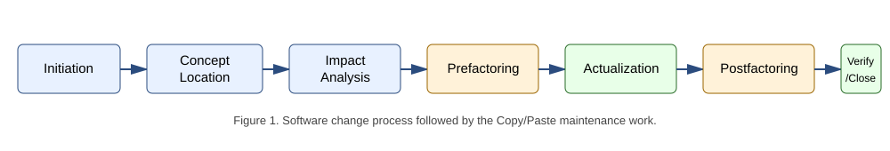
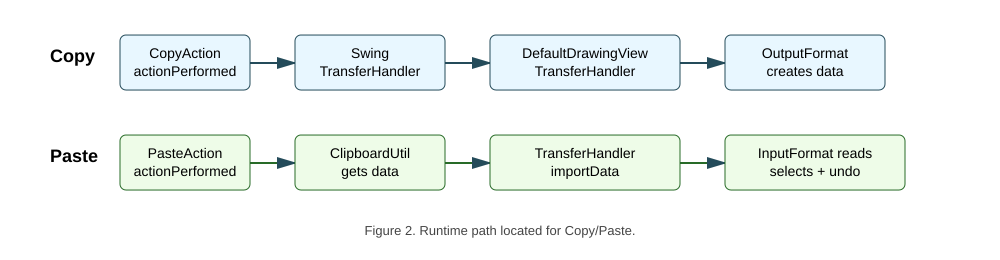
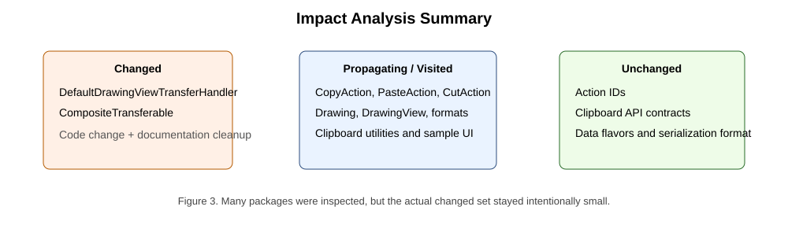
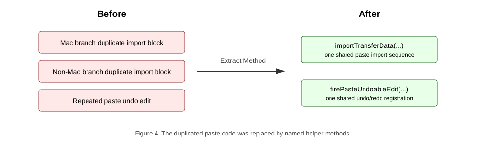
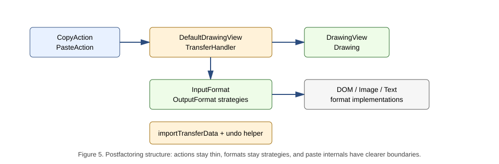
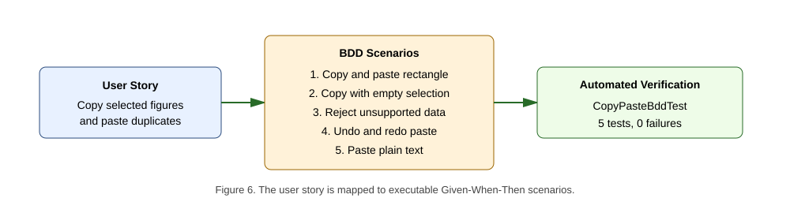

# Software Maintenance Report - Copy/Paste in JHotDraw

Full Name: [fill in full name]

Student Exam Number: [fill in exam number]

Student Email: [fill in student email]

Course Number: SB5-MAI

Number of Pages: 19 [update after final personal details and PDF export]

Lecturer: [fill in lecturer name and email]

Repository branch: `copy-paste-basic-editing-labs`

Report date: 11 June 2026

## Abstract

This report is part of the 5 ECTS Software Maintenance course. The objective of the course is to maintain an existing software repository by locating a feature, analysing the impact of a change, removing code smells, improving the internal structure, and verifying that the system still behaves correctly. The case study is JHotDraw, a Java/Swing drawing framework. The selected work area is the Basic Editing Copy/Paste feature.

The work documented here is a preventive maintenance change. The user-visible Copy/Paste behavior already existed, so the goal was not to redesign the feature from scratch. Instead, the goal was to understand where the feature lives, remove duplicated paste logic inside `DefaultDrawingViewTransferHandler`, clean small documentation smells in `CompositeTransferable`, and add focused automated tests. The refactoring extracted `importTransferData(...)` and `firePasteUndoableEdit(...)`, removed an unused private method, preserved the existing transfer-handler architecture, and verified the result with 13 JUnit tests, including 5 BDD-style Given-When-Then scenarios.

## Introduction

JHotDraw is a Java framework for building structured two-dimensional drawing editors. It is a useful software-maintenance case study because it is a real multi-module Maven project with many collaborating classes, legacy APIs, Swing user-interface code, data-transfer infrastructure, design patterns, and accumulated technical debt. Working with JHotDraw therefore requires the same discipline as maintaining unfamiliar production code: before changing behavior or structure, the maintainer must locate the relevant concept, understand the surrounding dependencies, estimate impact, change only the necessary code, and verify the result.

The feature work area for this report is Basic Editing - Copy/Paste. This feature was selected because it is central to the user experience of a drawing editor. A user expects to select an existing shape, copy it, paste it back into the drawing, and continue editing without recreating the same object manually. Although the user action appears simple, the implementation is spread across several architectural layers: Swing actions, clipboard utilities, Swing `TransferHandler`, the drawing view, input/output format strategies, and the drawing/figure domain model.

The maintenance objective was therefore:

1. Locate how Copy/Paste is implemented.
2. Identify code smells in the work area.
3. Refactor duplicated paste logic without changing user-visible behavior.
4. Verify copy, paste, selection after paste, unsupported data handling, and paste undo/redo with automated tests.
5. Document the result using the software change process used in the course.

## Initiation

The work follows the Software Change Process Model used in the course. A change starts with an initiation phase, then concept location, impact analysis, prefactoring, actualization, postfactoring, verification, and finally conclusion and discussion. The process matters because a maintenance task in legacy code can easily grow beyond its intended scope if the maintainer starts coding before understanding the feature and its dependencies.



The initiating change request was:

> Maintain the existing JHotDraw Basic Editing Copy/Paste feature by improving maintainability and adding verification, while preserving the current user-visible behavior.

The user story for the selected work area is:

> As a user editing a drawing, I want to copy selected figures and paste them back into the drawing, so that I can duplicate existing work without recreating it manually.

The acceptance criteria are:

| Requirement | Acceptance criterion |
| --- | --- |
| Copy selected figures | A selected figure can produce transferable drawing data. |
| Empty copy | Copy with no selected figures creates no drawing figure transferable. |
| Paste supported data | A supported transferable is imported into the active drawing. |
| Selection after paste | Pasted figures become selected. |
| Undoable paste | Paste creates an undoable edit, and undo/redo removes and restores pasted figures. |
| Unsupported data | Unsupported clipboard data is rejected without corrupting the drawing. |
| Extensibility | Registered `InputFormat` and `OutputFormat` implementations continue to drive supported formats. |

The team pipeline is based on GitHub flow. The work was done on the feature branch `copy-paste-basic-editing-labs`, branched from `develop`. The repository contains a GitHub Actions workflow in `.github/workflows/maven.yml`, which runs Maven build and test commands on push and pull request events targeting `develop`. This supports a self-testing baseline: changes should only be merged when the project still compiles and tests pass.

## Concept Location

The objective of concept location is to find the work area: the set of classes that implement the user-visible concept. For Copy/Paste, the initial search used static source-code search for names such as `copy`, `paste`, `Transferable`, `Clipboard`, `InputFormat`, and `OutputFormat`. The search then followed dependencies from the action classes to the Swing transfer infrastructure and finally to the drawing transfer handler.

The located runtime path is shown below.



Copy starts in `CopyAction.actionPerformed()`. That class resolves the focused component and delegates to Swing's `TransferHandler.exportToClipboard(...)`. In the drawing view, the active transfer handler is `DefaultDrawingViewTransferHandler`, which creates transfer data from selected figures by asking registered `OutputFormat` implementations to export the selection. Multiple transferable formats are combined through `CompositeTransferable`.

Paste starts in `PasteAction.actionPerformed()`. That action retrieves the clipboard through `ClipboardUtil` and delegates to `TransferHandler.importData(...)`. The drawing transfer handler then chooses a compatible `InputFormat`, reads the transferable into the drawing, finds the newly imported figures, selects them, optionally moves them to a drop location, and registers an undoable paste edit.

The main domain classes and responsibilities are:

| Domain class | Responsibility |
| --- | --- |
| `CopyAction` | User command entry point for Copy. Resolves the focused component and delegates to `TransferHandler.exportToClipboard`. |
| `PasteAction` | User command entry point for Paste. Reads clipboard contents and delegates to `TransferHandler.importData`. |
| `CutAction` | Adjacent clipboard action that shares export behavior with Copy. |
| `AbstractSelectionAction` | Common base for selection-related edit actions and enablement. |
| `ClipboardUtil` | Provides access to the system clipboard or a fallback clipboard. |
| `AWTClipboard` / `OSXClipboard` | Platform-specific clipboard wrappers. |
| `DefaultDrawingView` | Swing drawing component that owns selection state and installs the transfer handler. |
| `DrawingView` | Drawing-view abstraction used by the transfer handler. |
| `DefaultDrawingViewTransferHandler` | Core Copy/Paste coordinator. Exports selected figures and imports supported transfer data. |
| `Drawing` / `AbstractDrawing` | Drawing model and registry for input/output formats. |
| `Figure` | Domain object being copied, pasted, selected, transformed, and serialized. |
| `InputFormat` | Paste/import strategy interface. |
| `OutputFormat` | Copy/export strategy interface. |
| `DOMStorableInputOutputFormat` | Main native JHotDraw figure serialization format used by the Draw sample. |
| `ImageInputFormat` / `ImageOutputFormat` | Support image transfer behavior. |
| `TextInputFormat` | Supports pasting plain text into text-holder figures. |
| `CompositeTransferable` | Combines several transfer flavors into one clipboard payload. |
| `DrawView` / `DrawingPanel` | Sample application setup that registers formats and exposes actions. |

The concept-location conclusion is that Copy/Paste is not implemented by a single method named `copyFigure` or `pasteFigure`. It is a framework collaboration. The core class for the maintenance change, however, is `DefaultDrawingViewTransferHandler`.

## Impact Analysis

The objective of impact analysis is to estimate, before changing code, which classes and packages are affected by a maintenance change. This prevents accidental scope growth and helps decide where tests are needed.

### Static Impact Analysis

The initial impact set from concept location was:

| Class | Reason |
| --- | --- |
| `CopyAction` | User command entry point for copy. |
| `PasteAction` | User command entry point for paste. |
| `DefaultDrawingViewTransferHandler` | Core class for drawing transfer import/export behavior. |
| `DefaultDrawingView` | Installs the transfer handler and owns selection state. |
| `Drawing` | Supplies figures and registered formats. |
| `DOMStorableInputOutputFormat` | Main native drawing transferable format. |
| `ClipboardUtil` | Provides clipboard contents for paste. |

Static analysis showed that the real smell was local to the transfer handler. The actions and format interfaces participate in the feature, but their responsibilities were already correct. The estimated changed set was therefore much smaller than the visited set: `DefaultDrawingViewTransferHandler` for code refactoring and `CompositeTransferable` for minor documentation cleanup.



The public transfer-handler contracts were intentionally preserved. The refactoring did not change action IDs, data flavors, clipboard APIs, serialization formats, or `InputFormat`/`OutputFormat` interfaces.

### Dynamic Impact Analysis

Dynamic impact analysis asks whether the modified code is actually part of the runtime path. The modified method `importTransferData(...)` is called from the `importData(...)` paste flow. The verification was done by recompiling the project and running the Copy/Paste tests after the refactoring. The tests exercise the real `DefaultDrawingViewTransferHandler.importData(...)` path with crafted `Transferable` objects, so a regression in the changed paste flow would be visible in the test results.

The local verification commands were:

```bash
mvn -pl jhotdraw-samples/jhotdraw-samples-misc test
mvn clean test --file pom.xml
```

The Copy/Paste test module reported:

```text
Tests run: 13, Failures: 0, Errors: 0, Skipped: 0
```

The full Maven reactor also reported `BUILD SUCCESS`.

### Package List

The visited packages were:

| Package name | # of classes | Comments |
| --- | ---: | --- |
| `org.jhotdraw.action.edit` | 5 | Contains `CopyAction`, `PasteAction`, `CutAction`, `DuplicateAction`, and shared selection-action behavior. Propagating package, but unchanged. |
| `org.jhotdraw.api.gui` | 1 | Contains the editable component contract used by basic editing actions. Inspected but unchanged. |
| `org.jhotdraw.draw` | 6 | Contains `DefaultDrawingViewTransferHandler`, drawing views, drawing abstractions, and editor shortcut behavior. This is the most important package and contains the changed class. |
| `org.jhotdraw.draw.figure` | 3 | Contains figure abstractions and concrete figure types imported by image and text paste formats. Unchanged. |
| `org.jhotdraw.draw.io` | 7 | Contains `InputFormat` and `OutputFormat` implementations. Propagating package, but unchanged. |
| `org.jhotdraw.datatransfer` | 7 | Contains clipboard proxies and transferable wrappers. `CompositeTransferable` received documentation and small immutability cleanup. |
| `org.jhotdraw.app` | 2 | Registers and places actions in application menus. Unchanged. |
| `org.jhotdraw.gui.action` | 1 | Adds copy/paste to toolbar and popup action collections. Unchanged. |
| `org.jhotdraw.samples.draw` | 3 | Registers formats and contains test setup through `DrawFigureFactory`. Production code unchanged; tests added here. |

## Prefactoring

Prefactoring prepares the code before or during a change so that the actual maintenance work lands in cleaner structure. In this project, the change itself was behavior-preserving refactoring, so the prefactoring concepts from Clean Code were applied directly to the work area.

The main smell was duplicated paste import logic in `DefaultDrawingViewTransferHandler.importData(...)`. The method contains separate search branches for Mac OS X and non-Mac platforms because of data-flavor ordering differences. That platform-specific difference is valid, but after a matching `InputFormat` was found, both branches repeated the same import sequence:

1. Snapshot existing figures.
2. Read the transferable into the drawing.
3. Compute which figures are new.
4. Clear the old selection.
5. Select imported figures.
6. Add imported figures to the transferred figure set.
7. Move them to the drop point if needed.
8. Fire the paste undoable edit.
9. Return success, or try the next format after an `IOException`.

There was also repeated paste undo-edit construction, an unused private method that threw `UnsupportedOperationException`, and low-quality comments/Javadoc.



### Meaningful Names

Clean Code emphasizes that names should reveal intent. The extracted methods were named after their responsibilities:

| New method | Name meaning |
| --- | --- |
| `importTransferData(...)` | Imports one supported transferable through one selected `InputFormat`. |
| `firePasteUndoableEdit(...)` | Fires the undoable edit that represents a paste operation. |

These names make the high-level `importData(...)` method easier to read. Instead of forcing the maintainer to decode a repeated 35-line block, the code now states the work directly.

Small documentation names were also improved in `CompositeTransferable`. Typo-level Javadoc issues were corrected so the class documentation no longer distracts the reader.

### Functions and the Stepdown Rule

The Stepdown Rule says a function should read top-down, with high-level operations followed by lower-level helper functions. After the refactoring, the search logic in `importData(...)` stays at a high level:

```java
if (format.isDataFlavorSupported(flavor)) {
    if (importTransferData(comp, t, transferFigures, dropPoint, view, drawing, format)) {
        retValue = true;
        break SearchLoop;
    }
}
```

The lower-level details are in `importTransferData(...)`:

```java
private boolean importTransferData(
        final JComponent comp,
        Transferable t,
        final HashSet<Figure> transferFigures,
        final Point dropPoint,
        final DrawingView view,
        final Drawing drawing,
        InputFormat format) throws UnsupportedFlavorException {
    LinkedList<Figure> existingFigures = new LinkedList<>(drawing.getChildren());
    try {
        format.read(t, drawing, false);
        final LinkedList<Figure> importedFigures = new LinkedList<>(drawing.getChildren());
        importedFigures.removeAll(existingFigures);
        view.clearSelection();
        view.addToSelection(importedFigures);
        transferFigures.addAll(importedFigures);
        moveToDropPoint(comp, transferFigures, dropPoint);
        firePasteUndoableEdit(drawing, importedFigures);
        return true;
    } catch (IOException e) {
        e.printStackTrace();
        // Failed to read transferable; try with the next InputFormat.
        return false;
    }
}
```

The undo behavior was similarly moved into `firePasteUndoableEdit(...)`, keeping one reason to change in one place.

### Removing Redundancy and Dead Code

The duplicate import sequence was removed from the Mac and non-Mac branches. The repeated undo-edit construction was centralized in one method. The unused private `getDrawing()` method, which threw an unimplemented-operation exception, was removed because it was private, unused, and not a real extension point.

### Comments and JavaDoc

Comments should clarify intent, not apologize for code. The older wording around repaint behavior was improved to explain why the code exists:

```java
// Ensure that the drawing view repaints the area containing the dropped figures.
```

The failed-read comment was also made explicit:

```java
// Failed to read transferable; try with the next InputFormat.
```

This matters because maintenance is partly program comprehension. Incorrect or noisy comments slow down future maintainers even when runtime behavior is unaffected.

### Formatting

The extracted methods improve vertical openness by separating the high-level search from the lower-level import and undo details. They also improve vertical closeness because related operations now stay together: reading the format, computing imported figures, selecting them, moving them, and firing undo are kept in one method.

Summary of prefactoring: duplicated code was removed, a dead method was deleted, names became more intention-revealing, comments were improved, and the paste behavior now has clearer internal structure.

## Actualization

The objective of actualization is to incorporate the change into the existing system. Since this was a preventive maintenance change, the existing Copy/Paste behavior was preserved. The old architecture remained intact:

| Layer | Role after actualization |
| --- | --- |
| Actions | `CopyAction` and `PasteAction` still delegate to Swing transfer handling. |
| Transfer handler | `DefaultDrawingViewTransferHandler` still coordinates copy/paste import/export. |
| Strategies | `InputFormat` and `OutputFormat` still define supported data formats. |
| Domain model | `Drawing` and `Figure` still represent drawings and drawing objects. |
| Infrastructure | `ClipboardUtil`, `CompositeTransferable`, and Java/Swing transfer APIs still provide clipboard mechanics. |

The actualized code change was:

| File | Change | Purpose |
| --- | --- | --- |
| `DefaultDrawingViewTransferHandler.java` | Extracted `importTransferData(...)`. | Removes duplicated successful paste import logic. |
| `DefaultDrawingViewTransferHandler.java` | Extracted `firePasteUndoableEdit(...)`. | Centralizes paste undo/redo registration. |
| `DefaultDrawingViewTransferHandler.java` | Removed unused private method. | Removes dead code. |
| `DefaultDrawingViewTransferHandler.java` | Improved comments. | Makes fallback and repaint behavior clearer. |
| `CompositeTransferable.java` | Improved documentation and final field references. | Improves maintainability without changing behavior. |

### Single Responsibility Principle

The old `importData(...)` method mixed format search, transferable import, selection update, drop movement, and undo registration. After the refactoring, those responsibilities are clearer:

| Responsibility | Location |
| --- | --- |
| Search for a supported format | `importData(...)` |
| Import one selected transferable format | `importTransferData(...)` |
| Register undo/redo for pasted figures | `firePasteUndoableEdit(...)` |
| Move dropped figures | `moveToDropPoint(...)` |

The class is still a large integration class, but the changed paste behavior now has better internal responsibility boundaries.

### Open-Closed Principle

JHotDraw's paste mechanism is open for extension through `InputFormat`. To add support for a new clipboard format, a developer can implement and register a new `InputFormat` without rewriting `CopyAction`, `PasteAction`, or the handler's public API. The refactoring preserved that extension point.

### Liskov Substitution Principle

The handler works against interfaces and abstractions. Any `InputFormat` implementation can be used as long as it obeys the expected contract: report supported flavors and read supported data into the drawing. `DOMStorableInputOutputFormat`, `ImageInputFormat`, and `TextInputFormat` remain substitutable through this interface.

### Interface Segregation Principle

JHotDraw separates reading and writing data into `InputFormat` and `OutputFormat`. A class that only imports data does not need to implement export behavior, and a class that only exports data does not need to implement import behavior. The Copy/Paste feature benefits from this separation because copy and paste can evolve independently.

### Dependency Inversion Principle

The higher-level transfer handler depends on `Drawing`, `DrawingView`, `InputFormat`, and `OutputFormat`, not on concrete format classes. The concrete details are supplied by the drawing setup. This is why the change could remain small: the handler's public dependency direction already points toward abstractions.

## Postfactoring

Postfactoring reviews the resulting structure after the change. The main improvement is that the duplicated paste sequence now has one home. The updated structure keeps actions thin, keeps formats as strategies, and keeps the paste internals easier to understand.



Before the change, a future maintainer fixing paste selection or paste undo behavior would have needed to inspect multiple repeated blocks. After the change, that maintainer can update `importTransferData(...)` or `firePasteUndoableEdit(...)` directly. This reduces the risk that the Mac and non-Mac paste paths drift apart.

The change does not make `DefaultDrawingViewTransferHandler` perfect. The class still coordinates copy, paste, drag/drop, file-list import, selection, figure movement, and undo behavior. That is remaining technical debt. However, postfactoring shows that the selected smell was reduced without widening the public interface or changing the architecture.

The old structure can be summarized as:

```text
importData(...)
  Mac search branch -> duplicated successful import block
  non-Mac search branch -> duplicated successful import block
  file-list branch -> repeated undo registration
```

The new structure is:

```text
importData(...)
  Mac search branch -> importTransferData(...)
  non-Mac search branch -> importTransferData(...)
  file-list branch -> firePasteUndoableEdit(...)

importTransferData(...)
  read, compute imported figures, select, move, fire undo

firePasteUndoableEdit(...)
  undo removes pasted figures
  redo adds pasted figures again
```

## Verification

The verification target is the code most at risk from the refactoring: the drawing-view transfer handler paste path and the native DOM transferable round-trip used by Copy/Paste.

The added tests are:

| Test file | Purpose |
| --- | --- |
| `DOMStorableInputOutputFormatTest.java` | Tests the native JHotDraw DOM transferable round-trip used by copy/paste. |
| `DefaultDrawingViewTransferHandlerTest.java` | Tests the real drawing-view transfer handler for selected copy, empty copy, supported paste, selection, unsupported data, and undo/redo. |
| `CopyPasteBddTest.java` | Automates user-story-level Given-When-Then scenarios in JUnit style. |

The tests are located in:

```text
jhotdraw-samples/jhotdraw-samples-misc/src/test/java/org/jhotdraw/samples/draw/
```

The test cases cover:

| Behavior | Test evidence |
| --- | --- |
| Native DOM transferable round-trip | `createsTransferableThatRoundTripsSelectedFigure` |
| Replace behavior | `readWithReplaceClearsExistingFigures` |
| Unsupported DOM flavor rejection | `rejectsUnsupportedDataFlavor` |
| Selected figures create a transferable | `copySelectedFigureCreatesTransferable` |
| Empty selection creates no transferable | `copyWithoutSelectionCreatesNoTransferable` |
| Supported paste adds and selects imported figure | `pasteSupportedTransferableAddsAndSelectsImportedFigure` |
| Unsupported paste leaves drawing unchanged | `pasteUnsupportedTransferableLeavesDrawingUnchanged` |
| Paste fires undoable edit | `pasteFiresUndoableEditThatCanUndoAndRedoImportedFigure` |

The verification commands were:

```bash
mvn -pl jhotdraw-samples/jhotdraw-samples-misc test
mvn clean test --file pom.xml
```

The sample module result was:

```text
Tests run: 13, Failures: 0, Errors: 0, Skipped: 0
BUILD SUCCESS
```

The full clean Maven reactor also ended with `BUILD SUCCESS`.

### BDD Test and Scenario Analysis

The user story is:

> As a user editing a drawing, I want to copy selected figures and paste them back into the drawing, so that I can duplicate existing work without recreating it manually.

JGiven is a Java BDD framework that structures tests as readable Given/When/Then stages and can generate scenario reports from test execution. In this project, no new JGiven dependency was added. The reason is that the sample module already had JUnit 4, and the maintenance scope was intentionally kept small. Instead, the project uses JUnit methods with Given-When-Then names and arrange/act/assert bodies. This preserves the scenario analysis while avoiding dependency and build-configuration risk.

The scenario mapping is:

| User-story aspect | BDD scenario |
| --- | --- |
| Copy and paste selected object | Given a drawing with one selected rectangle, when the user copies and pastes it, then the drawing contains two rectangles and the pasted rectangle is selected. |
| Copy requires selection | Given no figures are selected, when the user invokes copy, then no drawing figure transferable is produced. |
| Paste rejects unsupported data | Given unsupported clipboard data, when paste is invoked, then the drawing remains unchanged. |
| Paste is undoable | Given pasted figures were added, when undo and redo are invoked, then pasted figures are removed and added back. |
| Other supported content | Given plain text and a registered `TextInputFormat`, when paste is invoked, then a text-holder figure is added. |



The five BDD-style scenarios are automated in `CopyPasteBddTest`:

```text
Running org.jhotdraw.samples.draw.CopyPasteBddTest
Tests run: 5, Failures: 0, Errors: 0, Skipped: 0
```

### Verification Limits

The automated tests intentionally avoid the real operating-system clipboard. Early clipboard-level testing can become flaky because clipboard contents depend on the host environment and other running processes. Instead, the tests pass crafted `Transferable` objects directly to the handler. This makes the suite deterministic and suitable for headless CI.

The remaining verification gap is full GUI behavior through menus, keyboard focus, toolbar actions, and the operating-system clipboard. That risk is documented as future work and can be mitigated with a manual GUI test or a Swing UI automation test.

### Requirement-To-Test Traceability

Traceability matters because the purpose of verification is not only to run many tests, but to show that the tests answer the original user story. The table below connects the acceptance criteria from Initiation to the automated tests that protect them.

| Acceptance criterion | Automated evidence | Comment |
| --- | --- | --- |
| Copy creates transfer data from selected figures. | `copySelectedFigureCreatesTransferable` and BDD scenario 1. | Confirms the handler can export a selected `RectangleFigure`. |
| Copy with empty selection does not create a figure copy. | `copyWithoutSelectionCreatesNoTransferable` and BDD scenario 2. | Prevents accidental clipboard data when no figure is selected. |
| Paste imports supported transfer data. | `pasteSupportedTransferableAddsAndSelectsImportedFigure` and BDD scenario 1. | Confirms a compatible transferable adds a cloned figure to the drawing. |
| Pasted figures become selected. | `pasteSupportedTransferableAddsAndSelectsImportedFigure` and BDD scenario 1. | Protects the expected editor workflow after paste. |
| Paste is undoable. | `pasteFiresUndoableEditThatCanUndoAndRedoImportedFigure` and BDD scenario 4. | Confirms the extracted undo helper still fires a usable undoable edit. |
| Unsupported data is rejected safely. | `rejectsUnsupportedDataFlavor`, `pasteUnsupportedTransferableLeavesDrawingUnchanged`, and BDD scenario 3. | Protects the drawing from unsupported clipboard content. |
| Registered formats drive supported data types. | `createsTransferableThatRoundTripsSelectedFigure` and BDD scenario 5. | Confirms DOM format and text format behavior through existing strategy interfaces. |

This matrix also explains why the tests are placed in the sample module. The sample module provides `DrawFigureFactory`, `RectangleFigure`, and realistic format registration for the Draw sample, so the tests exercise behavior close to the real copy/paste workflow while staying deterministic and headless.

### Manual Verification Checklist

The automated suite is the main regression safety net, but a final release candidate should also be checked manually in the running Draw sample because Swing focus, menu wiring, keyboard shortcuts, and the operating-system clipboard are difficult to prove with the current unit tests. The following checklist can be used as manual evidence in the appendix if screenshots are required:

| Manual check | Expected result |
| --- | --- |
| Start the Draw sample application. | The application opens without build or startup errors. |
| Draw or create one rectangle. | A visible figure appears in the drawing view. |
| Select the rectangle and invoke Copy from the menu or shortcut. | No visible change to the original figure; clipboard export succeeds. |
| Invoke Paste. | A duplicate figure appears in the drawing. |
| Check selection after paste. | The pasted figure is selected, not the original. |
| Invoke Undo. | The pasted figure is removed. |
| Invoke Redo. | The pasted figure is restored. |
| Paste unsupported external clipboard text into a drawing without `TextInputFormat`. | Drawing remains unchanged. |

This checklist is intentionally separated from the automated result. The report claims automated verification through JUnit. A manual GUI check should only be claimed after it has actually been performed and documented with screenshots.

## Conclusion

This report documented a complete maintenance pass over the JHotDraw Basic Editing Copy/Paste feature. The work started from a user story and followed the course software change process. Concept location found that Copy/Paste is a composite feature involving actions, Swing transfer infrastructure, clipboard utilities, a drawing-view transfer handler, registered input/output formats, and the drawing/figure model.

Impact analysis showed that many packages must be understood, but the actual safe change could stay small. The key code smell was duplicated paste import logic in `DefaultDrawingViewTransferHandler.importData(...)`, especially across the Mac and non-Mac input-format search branches. The refactoring extracted `importTransferData(...)` and `firePasteUndoableEdit(...)`, removed dead code, improved comments, and preserved public behavior.

The resulting structure better follows Clean Code and SOLID principles. The handler still acts as an integration point, but the repeated paste behavior now has named internal methods and one place to change. Verification was strengthened with 13 automated JUnit tests, including 5 BDD-style user scenarios, and the full Maven project builds successfully from a clean test run.

## Discussion

Several things could have been better. First, `DefaultDrawingViewTransferHandler` is still a large class. It handles copy, paste, drag/drop, file-list import, figure movement, selection updates, and undo events. The refactoring improved the paste internals but did not split the class into smaller collaborators. A future change could extract separate responsibilities for format search, file-list import, and paste undo creation.

Second, `CopyAction`, `CutAction`, and `PasteAction` share similar focused-component lookup behavior. That is a real duplication smell, but it was intentionally left out because fixing it would widen the impact set across action classes. For this report, limiting the change to the located smell was safer.

Third, the BDD automation uses JUnit Given-When-Then method names instead of JGiven stage classes. This was a practical scope decision. Adding JGiven could produce nicer scenario reports, but it would also introduce new dependency and configuration work. The current approach verifies the behavior while keeping the build smaller.

The main failure during test planning was the idea of using the real OS clipboard in automated tests. That approach is unreliable in headless environments and can be affected by external processes. The mitigation was to stub clipboard contents with crafted `Transferable` objects. The alternative would be full Swing UI automation, but that would be slower and more fragile for this maintenance scope.

The most important lesson is that impact analysis helps protect the change boundary. The codebase contains more smells than one report should fix. By keeping the changed set focused, the refactoring stayed reviewable, testable, and aligned with the selected user story.

## References & Sources

[1] R. C. Martin, Clean Code: A Handbook of Agile Software Craftsmanship. Prentice Hall, 2008.

[2] R. C. Martin, Clean Architecture: A Craftsman's Guide to Software Structure and Design. Prentice Hall, 2017.

[3] M. Fowler, Refactoring: Improving the Design of Existing Code, 2nd ed. Addison-Wesley, 2018.

[4] M. Fowler, "Continuous Integration," 2006. Available: https://martinfowler.com/articles/continuousIntegration.html

[5] D. North, "Introducing BDD," 2006. Available: https://dannorth.net/introducing-bdd/

[6] JGiven, "BDD in plain Java." Available: https://jgiven.org

[7] JHotDraw course repository fork, branch `copy-paste-basic-editing-labs`.

## Appendix

### Appendix A - Main Changed Files

```text
jhotdraw-core/src/main/java/org/jhotdraw/draw/DefaultDrawingViewTransferHandler.java
jhotdraw-datatransfer/src/main/java/org/jhotdraw/datatransfer/CompositeTransferable.java
```

### Appendix B - Added Test Files

```text
jhotdraw-samples/jhotdraw-samples-misc/src/test/java/org/jhotdraw/samples/draw/DOMStorableInputOutputFormatTest.java
jhotdraw-samples/jhotdraw-samples-misc/src/test/java/org/jhotdraw/samples/draw/DefaultDrawingViewTransferHandlerTest.java
jhotdraw-samples/jhotdraw-samples-misc/src/test/java/org/jhotdraw/samples/draw/CopyPasteBddTest.java
```

### Appendix C - Verification Commands

```bash
mvn -pl jhotdraw-samples/jhotdraw-samples-misc test
mvn clean test --file pom.xml
```

### Appendix D - Documentation Sources Used

```text
BobsWork/Portfolio_Copy_Paste.md
BobsWork/06_RefactoringLab1_Code_Smells_Copy_Paste.md
BobsWork/09_TestLab1_Copy_Paste.md
BobsWork/10_BDDLab_Copy_Paste.md
bob/docs/portfolio/*.md
```

### Appendix E - Figure List

| Figure | File |
| --- | --- |
| Figure 1 - Software change process | `bob/docs/portfolio/figures/software-change-process.svg` |
| Figure 2 - Copy/Paste runtime path | `bob/docs/portfolio/figures/copy-paste-runtime-path.svg` |
| Figure 3 - Impact summary | `bob/docs/portfolio/figures/impact-summary.svg` |
| Figure 4 - Refactoring before/after | `bob/docs/portfolio/figures/refactoring-before-after.svg` |
| Figure 5 - Postfactoring structure | `bob/docs/portfolio/figures/postfactoring-structure.svg` |
| Figure 6 - BDD verification | `bob/docs/portfolio/figures/bdd-verification.svg` |
